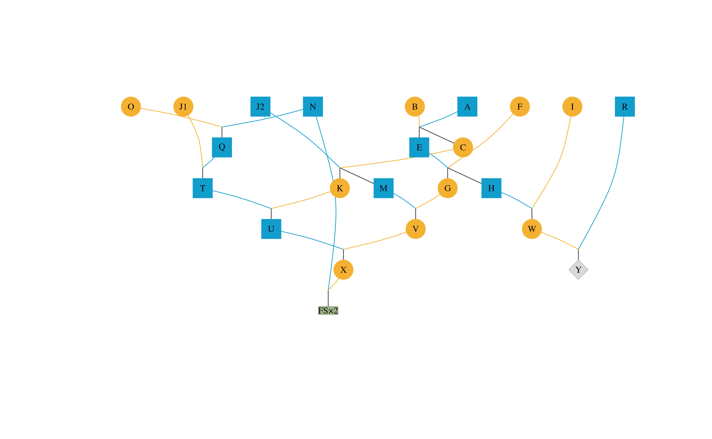
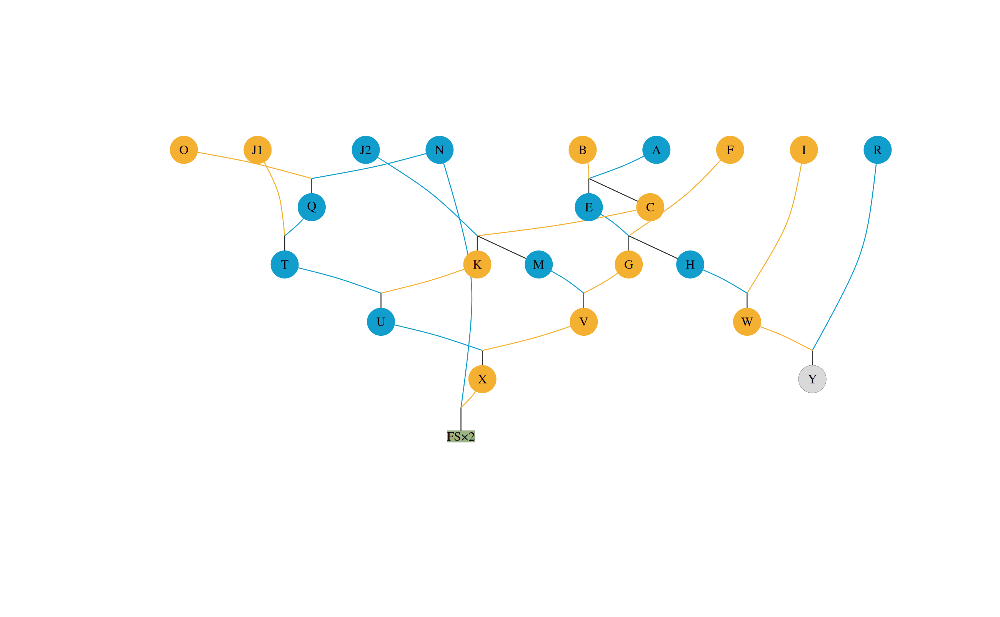
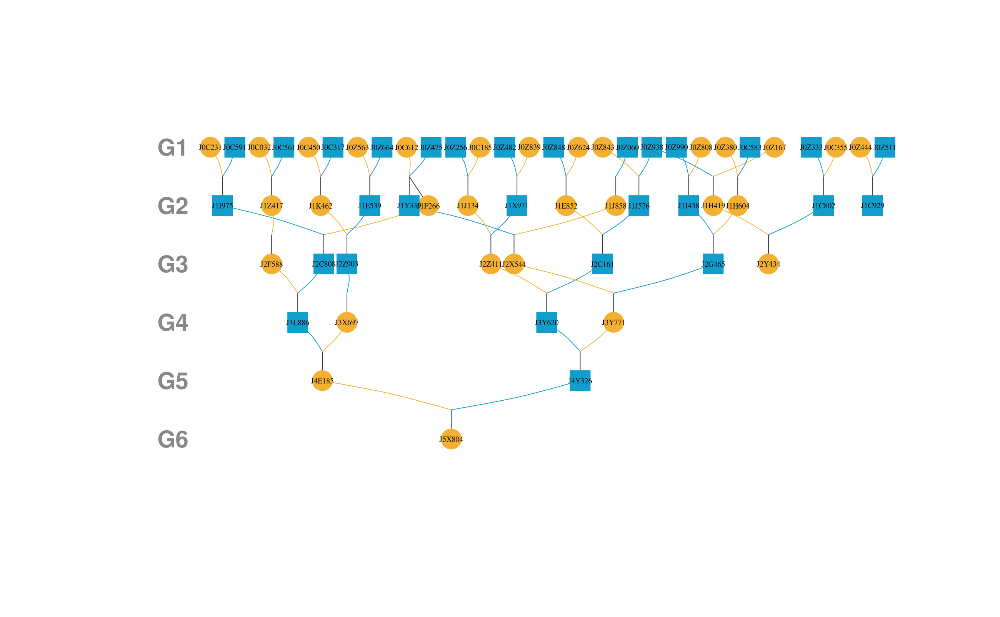
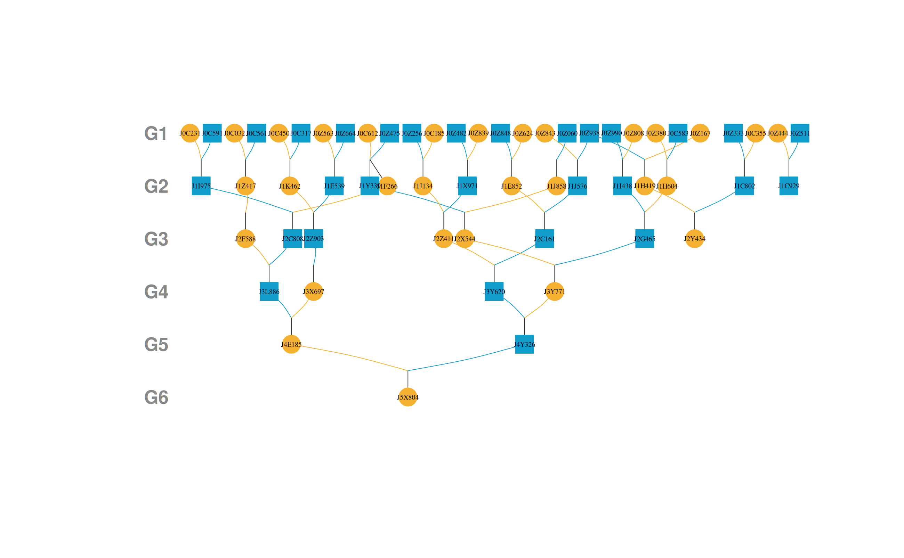
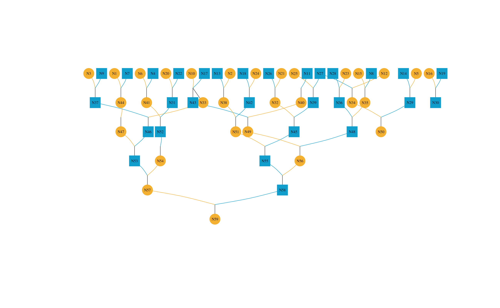
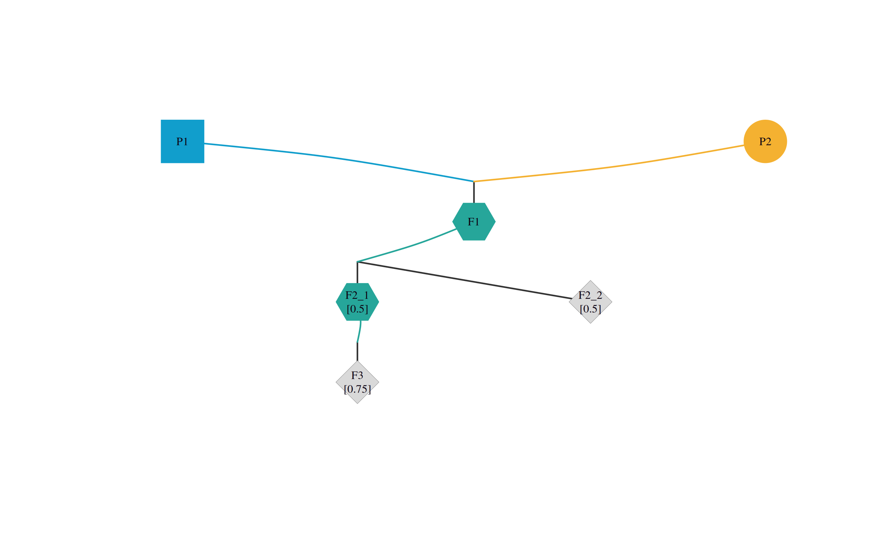

# Pedigree Visualization in R

`visPedigree` provides pedigree visualization in R for animal and plant
breeding data. This vignette shows how to use
[`visped()`](https://luansheng.github.io/visPedigree/reference/visped.md)
to draw hierarchical pedigree graphs, simplify large full-sib families,
trace or highlight individuals, display inbreeding coefficients, and
export vector PDF or SVG graphics.

1.  [Drawing the pedigree graph](#id_1)  
    1.1 [A simple pedigree graph](#id_1-1)  
    1.1.1 [Highlighting specific individuals](#id_1-1-1)  
    1.1.2 [Showing inbreeding coefficients](#id_1-1-2)  
    1.1.3 [Drawing a plant pedigree with monoecious
    individuals](#id_1-1-3)  
    1.2 [A reduced pedigree graph](#id_1-2)  
    1.3 [An outlined pedigree graph](#id_1-3)  
    1.4 [How to use this package in a selective breeding
    program](#id_1-4)  
    1.4.1 [Analysis of founders for an individual](#id_1-4-1)  
    1.4.2 [The contribution of different families in a selective
    breeding program](#id_1-4-2)

## 1 Drawing the pedigree

The **visped** function takes a pedigree tidied by the `tidyped`
function and outputs a hierarchical graph for all individuals in the
pedigree. The graph can be displayed on the default graphics device and
saved as a PDF file. The graph in the PDF file is a vector drawing,
which is legible and avoids overlapping. It is especially useful when
the number of individuals is large or when individual labels are long.
This function can visualize very large pedigrees (\> 10,000 individuals
per generation) by compacting full-sib individuals. It is particularly
effective for aquatic animal pedigrees, which typically include many
full-sib families per generation in the nucleus breeding population. A
pedigree outline without individual labels is shown if the graph width
exceeds the maximum PDF width (200 inches). This helps breeders quickly
review the population construction process and identify any introduction
of new genetic material.

**Important Note:** It is strongly recommended to set the `cand`
parameter when tidying a pedigree. Pruning the pedigree by specifying
candidates allows for more accurate generation inference and a more
logical layout in the resulting pedigree tree.

Additionally, isolated individuals (those with no parents and no
progeny) are automatically filtered out by
[`visped()`](https://luansheng.github.io/visPedigree/reference/visped.md)
to prevent cluttering the graph. These individuals are assigned
Generation 0 during the tidying process.

A small pedigree is drawn in the following figure. The following code
also demonstrates how to save the graph as a high-quality vector graphic
in a PDF file.

``` r

tidy_small_ped <-
  tidyped(ped = small_ped,
          cand = c("Y", "Z1", "Z2"))
visped(tidy_small_ped, 
        compact = TRUE, 
        cex=0.5, 
        symbolsize=10, 
        file = tempfile(fileext = ".pdf"))
#> Pedigree saved to: /tmp/RtmpzBkhDt/file27b16105d3c.pdf
#> Label cex: 0.5. Symbol size: 10. Adjust 'cex' and 'symbolsize' if labels are too large or small.
```


By default, `shapeby = "sex"` encodes individual sex by shape. Females
are circles, males are squares, individuals of unknown sex are diamonds,
and monoecious individuals are hexagons. Node color also identifies sex:
dark sky blue indicates males, dark goldenrod indicates females, teal
indicates monoecious individuals, and neutral grey indicates unknown
sex. Purple is reserved for highlighting. A compact family label such as
`FS×10` means that the rectangle represents 10 terminal, non-parent full
siblings; it is not an individual identifier. The ancestors are drawn at
the top and descendants at the bottom. Parents and offspring are
connected via virtual nodes. Lines from offspring to virtual nodes are
dark grey, while parental edges use the corresponding male, female, or
monoecious color.

Set `shapeby = "role"` to use the legacy role-based symbol scheme, where
individual records are circles and compact full-sib family summaries are
green-grey rectangles. Compact family summaries remain green-grey
rectangles in both modes. In `shapeby = "role"` mode, real individuals
remain circles, but their fill colors still encode sex.

``` r

visped(tidy_small_ped, 
      compact = TRUE,
      cex=0.5, 
      symbolsize=10)
#> Label cex: 0.5. Symbol size: 10. Adjust 'cex' and 'symbolsize' if labels are too large or small.
#> Tip: Use 'file' to save as a legible vector PDF or SVG.
visped(tidy_small_ped, 
        compact = TRUE, 
        shapeby = "role",
        cex=0.5, 
        symbolsize=10)
#> Label cex: 0.5. Symbol size: 10. Adjust 'cex' and 'symbolsize' if labels are too large or small.
#> Tip: Use 'file' to save as a legible vector PDF or SVG.
```



### 1.1 A simple pedigree graph

The trimmed **simple_ped** pedigree is drawn and displayed on the
default graphics device. The **addgen** and **addnum** parameters need
to be set to TRUE when tidying the pedigree using the **tidyped**
function.

``` r

tidy_simple_ped <- tidyped(simple_ped)
visped(tidy_simple_ped, cex=0.3, symbolsize=10)
#> Label cex: 0.3. Symbol size: 10. Adjust 'cex' and 'symbolsize' if labels are too large or small.
#> Tip: Use 'file' to save as a legible vector PDF or SVG.
```


Generation labels can be added on the left margin of the pedigree graph
by setting `genlab = TRUE`. This is useful for deep pedigrees when you
want to quickly identify the generation of each row.

``` r

visped(tidy_simple_ped, cex = 0.3, symbolsize = 10, genlab = TRUE)
#> Label cex: 0.3. Symbol size: 10. Generation label cex: 0.909090909. Adjust 'cex', 'symbolsize', and 'genlabcex' if labels are too large or small.
#> Tip: Use 'file' to save as a legible vector PDF or SVG.
```



Instead of the default `G1`, `G2`, … labels, an unnamed character vector
can provide one custom label for each displayed generation, from top to
bottom. This is useful when the plotted pedigree layers have an
application-specific interpretation. The labels are not inferred from a
birth-year column, which may not correspond one-to-one with pedigree
generations in overlapping cohorts.

``` r

generation_labels <- paste0("Gen_", sort(unique(tidy_simple_ped$Gen)))
visped(tidy_simple_ped, cex = 0.3, symbolsize = 10, genlab = generation_labels, genlabcex=0.6)
#> Label cex: 0.3. Symbol size: 10. Generation label cex: 0.6. Adjust 'cex', 'symbolsize', and 'genlabcex' if labels are too large or small.
#> Tip: Use 'file' to save as a legible vector PDF or SVG.
```


In deep pedigrees the generation labels may appear small because their
size is tied to the node scaling. The `genlabcex` parameter lets you set
the generation-label size independently of the individual-label size
(`cex`). For example, when `cex` is deliberately small to fit many
individuals, you can still keep the generation labels readable:

``` r

# cex controls individual label size; genlabcex controls generation label size
visped(tidy_simple_ped, cex = 0.3, symbolsize = 15, genlab = TRUE, genlabcex = 0.8)
#> Label cex: 0.3. Symbol size: 15. Generation label cex: 0.8. Adjust 'cex', 'symbolsize', and 'genlabcex' if labels are too large or small.
#> Tip: Use 'file' to save as a legible vector PDF or SVG.
```



Figures displayed in the RStudio Plots panel often have limited
resolution. Individual IDs may overlap if the pedigree is large and the
plot area is restricted. This can be resolved by saving the graph as a
vector graphic in a PDF file. The **visped** function will suppress
output to the default device if `showgraph = FALSE`.

``` r

suppressMessages(visped(tidy_simple_ped, showgraph = FALSE, file = tempfile(fileext = ".pdf")))
```

By setting the **file** parameter, you can generate a high-definition
PDF version of the pedigree.

SVG output is also supported by using a file name ending in `.svg`. This
is useful when the pedigree graph needs to be edited in vector-graphics
software or embedded in web documents.

``` r

suppressMessages(visped(tidy_simple_ped, showgraph = FALSE, file = tempfile(fileext = ".svg")))
```

Custom node labels can be displayed either from a selected pedigree
column or from a character vector with one value per input row using
`labelvar`. Row-aligned vectors remain attached to the correct
individuals if the pedigree is internally tidied or reordered. Both
forms keep the underlying individual IDs available for tracing and
highlighting, while changing the text shown on individual nodes. Compact
full-sib family nodes still use the explicit `FS×N` family-size label
when `compact = TRUE`.

``` r

tidy_simple_ped[, ShortLabel := paste0("N", seq_len(.N))]
visped(tidy_simple_ped, labelvar = "ShortLabel", cex = 0.3, symbolsize = 10)
#> Label cex: 0.3. Symbol size: 10. Adjust 'cex' and 'symbolsize' if labels are too large or small.
#> Tip: Use 'file' to save as a legible vector PDF or SVG.

# A row-aligned vector is also accepted
visped(tidy_simple_ped, labelvar = rep("1x", nrow(tidy_simple_ped)),
       cex = 0.3, symbolsize = 10)
#> Label cex: 0.3. Symbol size: 10. Adjust 'cex' and 'symbolsize' if labels are too large or small.
#> Tip: Use 'file' to save as a legible vector PDF or SVG.
```



#### 1.1.1 Highlighting specific individuals

Specific individuals can be highlighted in the pedigree graph using the
**highlight** parameter. This is useful for marking candidates,
founders, or any individuals of interest.

You can provide a character vector of individual IDs to use the default
highlight colors (purple border and light purple fill):

``` r

visped(tidyped(small_ped), highlight = c("Y", "Z1"))
```


    #> Label cex: 0.65. Symbol size: 1. Adjust 'cex' and 'symbolsize' if labels are too large or small.
    #> Tip: Use 'file' to save as a legible vector PDF or SVG.

You can also highlight an individual and its relatives (ancestors and
descendants) by setting `trace = TRUE`:

``` r

# Highlight individual "Y" and all its ancestors and descendants
visped(tidyped(small_ped), highlight = "Y", trace = TRUE)
```


    #> Label cex: 0.65. Symbol size: 1. Adjust 'cex' and 'symbolsize' if labels are too large or small.
    #> Tip: Use 'file' to save as a legible vector PDF or SVG.

Alternatively, you can customize the colors by providing a list with
**ids**, **frame.color**, and **color**:

``` r

visped(tidyped(small_ped), 
       highlight = list(ids = c("Y", "Z1"), 
                        frame.color = "#4caf50", 
                        color = "#81c784"))
```


    #> Label cex: 0.65. Symbol size: 1. Adjust 'cex' and 'symbolsize' if labels are too large or small.
    #> Tip: Use 'file' to save as a legible vector PDF or SVG.

### 1.1.2 Showing inbreeding coefficients

Inbreeding coefficients can be displayed on the pedigree graph using the
**showf** parameter in the **visped** function. This requires that the
pedigree has been processed with inbreeding coefficients calculated
using the **inbreed** parameter in the **tidyped** function.

``` r

library(data.table)
#> 
#> Attaching package: 'data.table'
#> The following object is masked from 'package:base':
#> 
#>     %notin%
test_ped <- data.table(
  Ind = c("A", "B", "C", "D", "E"),
  Sire = c(NA, NA, "A", "C", "C"),
  Dam = c(NA, NA, "B", "B", "D"),
  Sex = c("male", "female", "male", "female", "male")
)
tidy_test_ped_inbreed <- tidyped(test_ped, inbreed = TRUE)
visped(tidy_test_ped_inbreed, showf = TRUE)
```


    #> Label cex: 0.65. Symbol size: 1. Adjust 'cex' and 'symbolsize' if labels are too large or small.
    #> Tip: Use 'file' to save as a legible vector PDF or SVG.
    #> Note: Inbreeding coefficients of 0 are not shown in the graph.

### 1.1.3 Drawing a plant pedigree with monoecious individuals

In plant breeding, many crop species are **monoecious** — a single plant
produces both male and female gametes, enabling **self-fertilization**
(selfing). When a plant serves as both sire and dam,
[`tidyped()`](https://luansheng.github.io/visPedigree/reference/tidyped.md)
with `selfing = TRUE` assigns it `Sex = "monoecious"`. In the graph,
monoecious individuals appear as **hexagons** with teal edges and fill,
and selfing edges (sire = dam) are drawn in teal.

The following example shows a multi-generation self-pollinating pedigree
with inbreeding coefficients displayed:

``` r

library(data.table)

# P1 × P2 → F1;  F1 selfs → F2_1, F2_2;  F2_1 selfs → F3
plant_ped <- data.table(
  Ind  = c("P1", "P2", "F1", "F2_1", "F2_2", "F3"),
  Sire = c(NA,   NA,   "P1", "F1",   "F1",   "F2_1"),
  Dam  = c(NA,   NA,   "P2", "F1",   "F1",   "F2_1")
)

tp_plant <- tidyped(plant_ped, selfing = TRUE, inbreed = TRUE)
#> Selfing mode: 2 individual(s) appear as both Sire and Dam: F1, F2_1. These will be assigned Sex = 'monoecious'.

visped(tp_plant, compact = TRUE, showf = TRUE, cex=0.5, symbolsize=10)
```



    #> Label cex: 0.5. Symbol size: 10. Adjust 'cex' and 'symbolsize' if labels are too large or small.
    #> Tip: Use 'file' to save as a legible vector PDF or SVG.
    #> Note: Inbreeding coefficients of 0 are not shown in the graph.

Self-fertilization produces rapid inbreeding: *f* = 0.5 after one
generation of selfing (`F2_1`, `F2_2`), and *f* = 0.75 after two (`F3`).
`F1` and `F2_1` are drawn as hexagons because they act as both sire and
dam; selfing edges are shown in teal. For the general shape and color
legend, see the introduction of Section 1.

See
[`vignette("tidy-pedigree", package = "visPedigree")`](https://luansheng.github.io/visPedigree/articles/tidy-pedigree.md),
section 3.9, for preparing plant pedigrees and calculating inbreeding
coefficients.

### 1.2 A reduced pedigree graph

Warning messages will be shown when you try to draw the pedigree graph
of the deep_ped dataset.

``` r

cand_J11_labels <- deep_ped[(substr(Ind, 1, 3) == "K11"), Ind]
visped(
  tidyped(deep_ped,
    cand = cand_J11_labels,
    tracegen = 3),
  cex=0.08,
  symbolsize=5.5
  )
```

      Too many individuals (>=3362) in one generation!!! Two choices:
    1. Removing full-sib individuals using the parameter compact = TRUE; or, 
    2. Visualizing all nodes without labels using the parameter outline = TRUE.
    Rerun visped() function!

The function indicates that there are too many individuals in a single
generation to draw a standard pedigree graph. It is recommended to use
the **compact** or **outline** parameters to simplify the pedigree.

First, let’s try the **compact** parameter and output it to a PDF file.
The plot on the default device may suffer from significant overlapping
due to the high density of individuals.

``` r

cand_J11_labels <- deep_ped[(substr(Ind,1,3) == "K11"),Ind]
visped(
  tidyped(
    deep_ped,
    cand = cand_J11_labels,
    trace = "up",
    tracegen = 3
  ),
  cex=0.08, 
  symbolsize=5.5,
  compact = TRUE,
  showgraph = TRUE,
  file = tempfile(fileext = ".pdf")
)
#> Pedigree saved to: /tmp/RtmpzBkhDt/file27b16a3147aa.pdf
#> Label cex: 0.08. Symbol size: 5.5. Adjust 'cex' and 'symbolsize' if labels are too large or small.
```


You can open the generated PDF file to view the high-definition pedigree
vector graph. Most rectangles at the bottom are compact family
summaries, and labels such as `FS×10` report the number of represented
full-sib individuals. The summary is sex-neutral because a compacted
family may contain individuals of different or unknown sex. Individual
labels may be shorter than their shapes and might not align perfectly.
Labels can be resized using `cex`; increasing it makes labels larger,
while decreasing it makes them smaller. The value typically ranges from
0 to 1, but can be larger, and adjustments of 0.1 are usually
sufficient. The **visped** function reports the `cex` value used to draw
the graph.

``` r

visped(
  tidyped(
    deep_ped,
    cand = cand_J11_labels,
    trace = "up",
    tracegen = 3
  ),
  compact = TRUE,
  cex = 0.83,
  showgraph = FALSE,
  file = tempfile(fileext = ".pdf")
)
#> Pedigree saved to: /tmp/RtmpzBkhDt/file27b156810812.pdf
#> Label cex: 0.83. Symbol size: 1. Adjust 'cex' and 'symbolsize' if labels are too large or small.
```

You can open the generated PDF file to view the high-definition pedigree
vectorgraph. The labels align better with the shapes compared to the
previous version. You can continue to adjust `cex` until the labels are
sized appropriately.

### 1.3 An outlined pedigree graph

Setting `outline = TRUE` produces an outlined pedigree graph. Individual
labels will not be shown in the graph. This is highly effective for
large pedigrees with many individuals.

The following code generates an outlined pedigree graph in a PDF file.

``` r

suppressMessages(visped(
  tidyped(
    deep_ped,
    cand = cand_J11_labels, 
    tracegen = 3),
  compact = TRUE,
  outline = TRUE,
  showgraph = TRUE,
  file = tempfile(fileext = ".pdf")
))
```


### 1.4 How to use this package in a selective breeding program

#### 1.4.1 An analysis of founders for an individual

Selective breeding is a process of enriching desirable minor genes from
multiple founders through successive generations of mating. This is
supported by the well-known infinitesimal model (or minor polygene
hypothesis).

We select the individual “K110550H” in the deep_ped dataset to visualize
its pedigree. The following code generates the pedigree graph for a
specific individual in a PDF file.

``` r

suppressWarnings(
  K110550H_ped <- tidyped(deep_ped, cand = "K110550H")
)
if(interactive()) {
  visped(K110550H_ped, compact = TRUE)
}
```

As you can see from the figure above, the number of founder individuals
(without parents) of the K110550H individual is 71. This indicates that
the individual has accumulated favorable genes from many founders,
contributing to genetic gain in the target traits.

#### 1.4.2 The contribution of different families in a selective breeding program

Under optimum contribution theory, families contribute different numbers
of individuals to the next generation, with higher-indexing families
contributing more. By visualizing pedigree, we can directly see the
contribution ratio of different families.

The code below shows the parental composition of 106 families born in
the nucleus breeding population in 2007. Setting `tracegen = 2` limits
the graph to two generations (parents and grandparents).

``` r

cand_2007_G8_labels <-
  big_family_size_ped[(Year == 2007) & (substr(Ind, 1, 2) == "G8"), Ind]
suppressWarnings(
  cand_2007_G8_tidy_ped_ancestor_2 <-
    tidyped(
      big_family_size_ped,
      cand = cand_2007_G8_labels,
      trace = "up",
      tracegen = 2
    )
)
sire_label <-
  unique(cand_2007_G8_tidy_ped_ancestor_2[Ind %in% cand_2007_G8_labels,
                                          Sire])
dam_label <-
  unique(cand_2007_G8_tidy_ped_ancestor_2[Ind %in% cand_2007_G8_labels,
                                          Dam])
sire_dam_label <- unique(c(sire_label, dam_label))
sire_dam_label <- sire_dam_label[!is.na(sire_dam_label)]
sire_dam_ped <-
  cand_2007_G8_tidy_ped_ancestor_2[Ind %in% sire_dam_label]
#> Warning: Subsetting removed parent records. Result is a plain data.table, not a tidyped.
#> Use tidyped(tp, cand = ids, trace = "up") to extract a valid sub-pedigree.
sire_dam_ped <-
  sire_dam_ped[, FamilyID := paste(Sire, Dam, sep = "")]
family_size <- sire_dam_ped[, .N, by = c("FamilyID")]
fullsib_family_label <- unique(sire_dam_ped$FamilyID)
suppressMessages(
  visped(
    cand_2007_G8_tidy_ped_ancestor_2,
    compact = TRUE,
    outline = TRUE,
    showgraph = TRUE
  )
)
```


In the above figure, 106 families are shown at bottom, the parents are
shown in middle, and the grandparents are shown at top. It can be seen
that the parents are composed of 80 sires and 106 dams. The parents are
from 54 full-sib families in the generation of grandparent.
Approximately 25 parents originate from just two full-sib families due
to the application of optimum contribution theory, accounting for 13.44%
of all parents.
