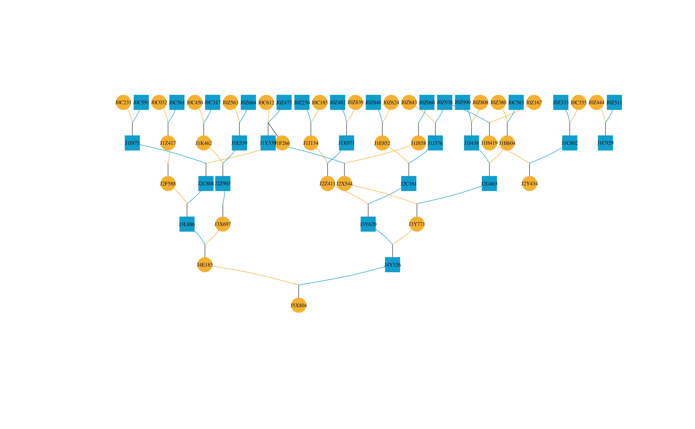
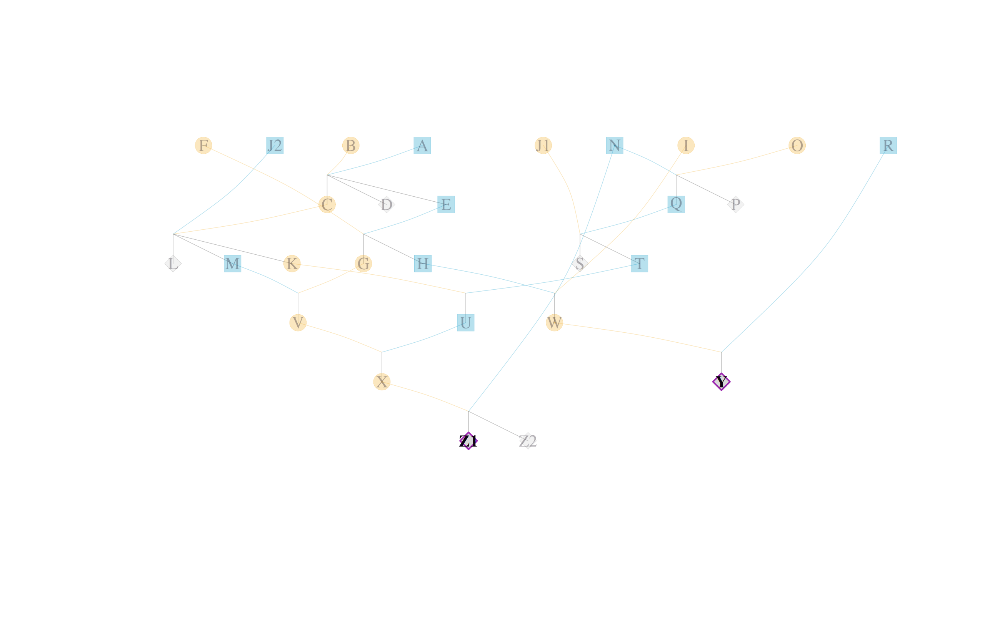
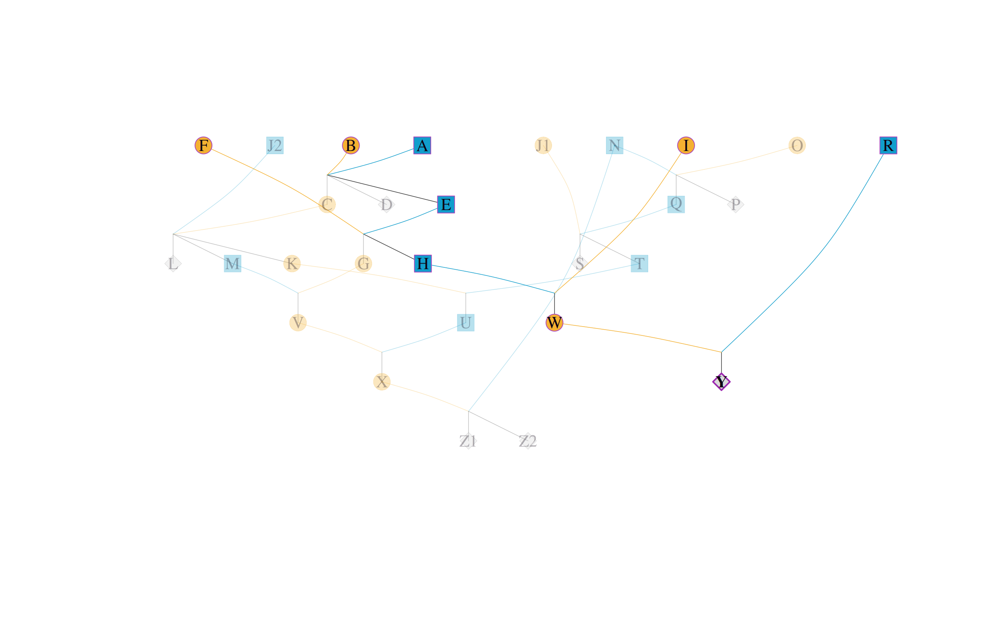
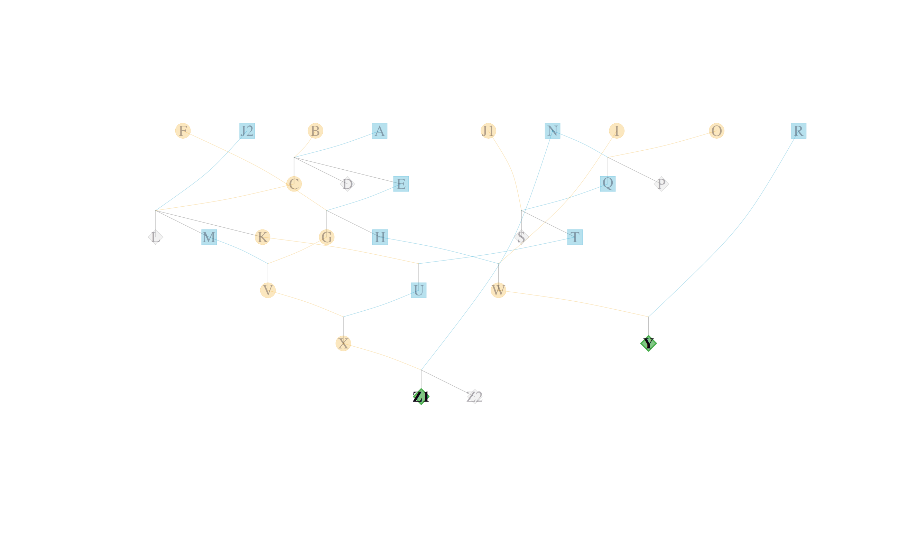
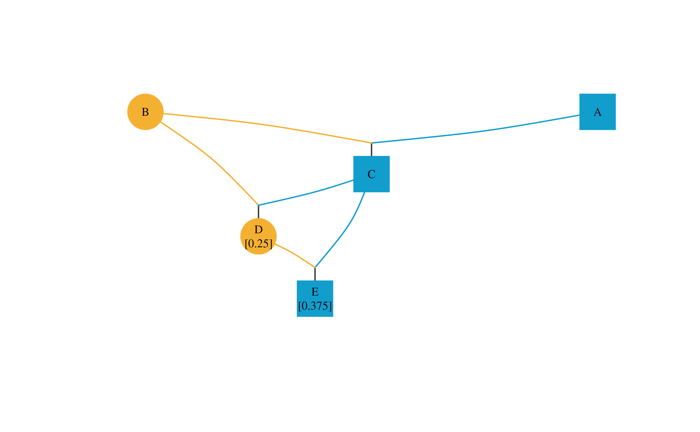
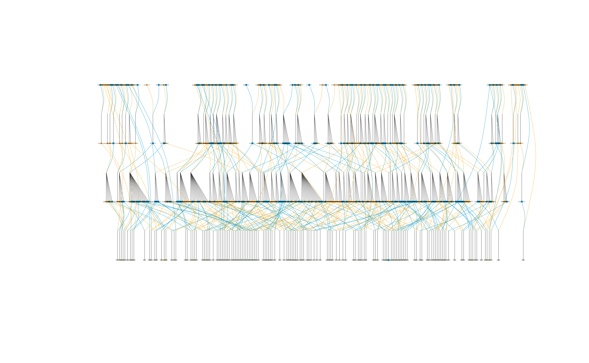
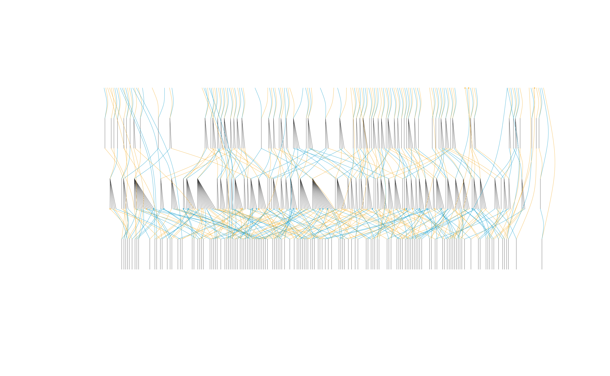
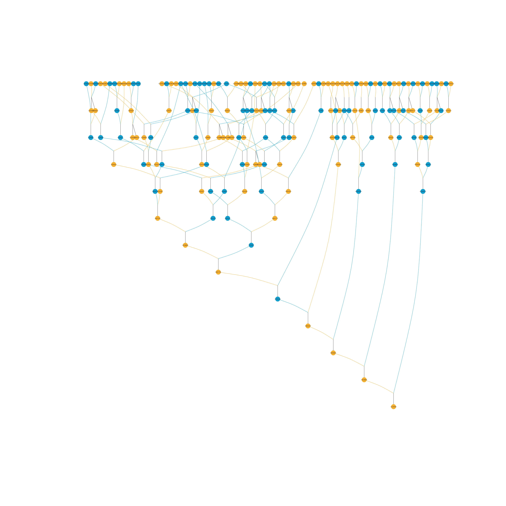
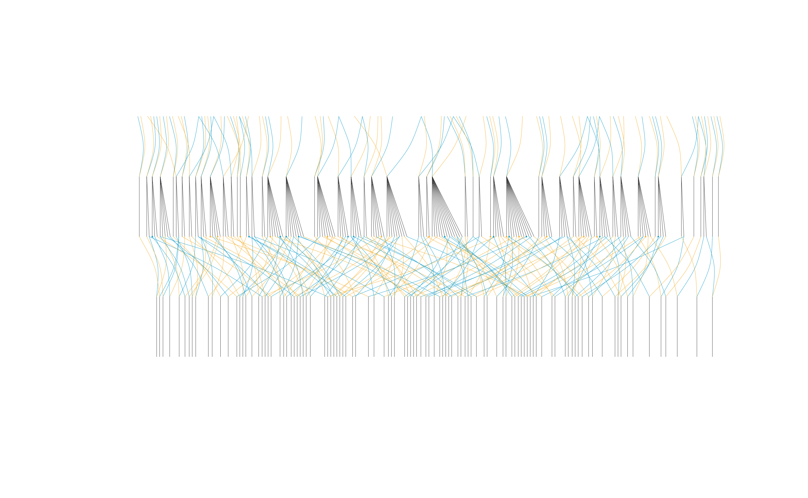

# 2. How to draw a pedigree

1.  [Drawing the pedigree graph](#id_1)  
    1.1 [A simple pedigree graph](#id_1-1)  
    1.1.1 [Highlighting specific individuals](#id_1-1-1)  
    1.1.2 [Showing inbreeding coefficients](#id_1-1-2)  
    1.2 [A reduced pedigree graph](#id_1-2)  
    1.3 [An outlined pedigree graph](#id_1-3)  
    1.4 [How to use this package in a selective breeding
    program](#id_1-4)  
    1.4.1 [Analysis of founders for an individual](#id_1-4-1)  
    1.4.2 [The contribution of different families in a selective
    breeding program](#id_1-4-2)

## 1 Drawing the pedigree

The **visped** function takes a pedigree tidied by the `tidyped`
function and outputs a hierarchical graph for all individuals in the
pedigree. The graph can be displayed on the default graphics device and
saved as a PDF file. The graph in the PDF file is a vector drawing,
which is legible and avoids overlapping. It is especially useful when
the number of individuals is large or when individual labels are long.
This function can visualize very large pedigrees (\> 10,000 individuals
per generation) by compacting full-sib individuals. It is particularly
effective for aquatic animal pedigrees, which typically include many
full-sib families per generation in the nucleus breeding population. A
pedigree outline without individual labels is shown if the graph width
exceeds the maximum PDF width (200 inches). This helps breeders quickly
review the population construction process and identify any introduction
of new genetic material.

**Important Note:** It is strongly recommended to set the `cand`
parameter when tidying a pedigree. Pruning the pedigree by specifying
candidates allows for more accurate generation inference and a more
logical layout in the resulting pedigree tree.

Additionally, isolated individuals (those with no parents and no
progeny) are automatically filtered out by
[`visped()`](https://luansheng.github.io/visPedigree/reference/visped.md)
to prevent cluttering the graph. These individuals are assigned
Generation 0 during the tidying process.

A small pedigree is drawn in the following figure. The following code
also demonstrates how to save the graph as a high-quality vector graphic
in a PDF file.

``` r
tidy_small_ped <-
  tidyped(ped = small_ped,
          cand = c("Y", "Z1", "Z2"))
visped(tidy_small_ped, compact = TRUE, file = tempfile(fileext = ".pdf"))
#> Pedigree saved to: /tmp/RtmpadVuVi/file1f442232e03f.pdf
#> Label cex: 0.65. Symbol size: 1. Adjust 'cex' and 'symbolsize' if labels are too large or small.
```


In the above graph, two shapes and three colors are used. Circles
represent individuals, while squares represent families. Dark sky blue
indicates males, dark goldenrod indicates females, and dark olive green
indicates unknown sex. For example, a dark sky blue circle represents a
male individual, while a dark goldenrod square represents all female
individuals in a full-sib family when `compact = TRUE`. The ancestors
are drawn at the top and descendants are drawn at the bottom in the
pedigree graph. Parents and offspring are connected via dummy nodes.
Lines from offspring to dummy nodes are dark grey, while lines from
dummy nodes to parents match the parents’ respective colors.

### 1.1 A simple pedigree graph

The trimmed **simple_ped** pedigree is drawn and displayed on the
default graphics device. The **addgen** and **addnum** parameters need
to be set to TRUE when tidying the pedigree using the **tidyped**
function.

``` r
tidy_simple_ped <- tidyped(simple_ped)
visped(tidy_simple_ped, cex=0.3, symbolsize=10)
#> Label cex: 0.3. Symbol size: 10. Adjust 'cex' and 'symbolsize' if labels are too large or small.
#> Tip: Use 'file' to save as a legible vector PDF.
```



Figures displayed in the RStudio Plots panel often have limited
resolution. Individual IDs may overlap if the pedigree is large and the
plot area is restricted. This can be resolved by saving the graph as a
vector graphic in a PDF file. The **visped** function will suppress
output to the default device if `showgraph = FALSE`.

``` r
suppressMessages(visped(tidy_simple_ped, showgraph = FALSE, file = tempfile(fileext = ".pdf")))
```

By setting the **file** parameter, you can generate a high-definition
PDF version of the pedigree.

#### 1.1.1 Highlighting specific individuals

Specific individuals can be highlighted in the pedigree graph using the
**highlight** parameter. This is useful for marking candidates,
founders, or any individuals of interest.

You can provide a character vector of individual IDs to use the default
highlight colors (purple border and light purple fill):

``` r
visped(tidyped(small_ped), highlight = c("Y", "Z1"))
```



    #> Label cex: 0.65. Symbol size: 1. Adjust 'cex' and 'symbolsize' if labels are too large or small.
    #> Tip: Use 'file' to save as a legible vector PDF.

You can also highlight an individual and its relatives (ancestors and
descendants) by setting `trace = TRUE`:

``` r
# Highlight individual "Y" and all its ancestors and descendants
visped(tidyped(small_ped), highlight = "Y", trace = TRUE)
```



    #> Label cex: 0.65. Symbol size: 1. Adjust 'cex' and 'symbolsize' if labels are too large or small.
    #> Tip: Use 'file' to save as a legible vector PDF.

Alternatively, you can customize the colors by providing a list with
**ids**, **frame.color**, and **color**:

``` r
visped(tidyped(small_ped), 
       highlight = list(ids = c("Y", "Z1"), 
                        frame.color = "#4caf50", 
                        color = "#81c784"))
```



    #> Label cex: 0.65. Symbol size: 1. Adjust 'cex' and 'symbolsize' if labels are too large or small.
    #> Tip: Use 'file' to save as a legible vector PDF.

### 1.1.2 Showing inbreeding coefficients

Inbreeding coefficients can be displayed on the pedigree graph using the
**showf** parameter in the **visped** function. This requires that the
pedigree has been processed with inbreeding coefficients calculated
using the **inbreed** parameter in the **tidyped** function.

``` r
library(data.table)
test_ped <- data.table(
  Ind = c("A", "B", "C", "D", "E"),
  Sire = c(NA, NA, "A", "C", "C"),
  Dam = c(NA, NA, "B", "B", "D"),
  Sex = c("male", "female", "male", "female", "male")
)
tidy_test_ped_inbreed <- tidyped(test_ped, inbreed = TRUE)
visped(tidy_test_ped_inbreed, showf = TRUE)
```



    #> Label cex: 0.65. Symbol size: 1. Adjust 'cex' and 'symbolsize' if labels are too large or small.
    #> Tip: Use 'file' to save as a legible vector PDF.
    #> Note: Inbreeding coefficients of 0 are not shown in the graph.

### 1.2 A reduced pedigree graph

Warning messages will be shown when you try to draw the pedigree graph
of the deep_ped dataset.

``` r
cand_J11_labels <- deep_ped[(substr(Ind, 1, 3) == "K11"), Ind]
visped(
  tidyped(deep_ped,
    cand = cand_J11_labels,
    tracegen = 3),
  cex=0.08,
  symbolsize=5.5
  )
```

      Too many individuals (>=3362) in one generation!!! Two choices:
    1. Removing full-sib individuals using the parameter compact = TRUE; or, 
    2. Visualizing all nodes without labels using the parameter outline = TRUE.
    Rerun visped() function!

The function indicates that there are too many individuals in a single
generation to draw a standard pedigree graph. It is recommended to use
the **compact** or **outline** parameters to simplify the pedigree.

First, let’s try the **compact** parameter and output it to a PDF file.
The plot on the default device may suffer from significant overlapping
due to the high density of individuals.

``` r
cand_J11_labels <- deep_ped[(substr(Ind,1,3) == "K11"),Ind]
visped(
  tidyped(
    deep_ped,
    cand = cand_J11_labels,
    trace = "up",
    tracegen = 3
  ),
  cex=0.08, 
  symbolsize=5.5,
  compact = TRUE,
  showgraph = TRUE,
  file = tempfile(fileext = ".pdf")
)
#> Pedigree saved to: /tmp/RtmpadVuVi/file1f444b18db39.pdf
#> Label cex: 0.08. Symbol size: 5.5. Adjust 'cex' and 'symbolsize' if labels are too large or small.
```



You can open the generated PDF file to view the high-definition pedigree
vectorgraph. Most of shapes are square at bottom, and the internal
numbers are the total number of male or female individuals for each
family. Individual labels may be shorter than the shapes and might not
align perfectly. Individual labels can be resized using the `cex`
parameter. The `cex` parameter controls the font size of individual IDs.
Increasing `cex` makes the labels larger, while decreasing it makes them
smaller. The `cex` value typically ranges from 0 to 1, but can be
larger; adjustments of 0.1 are usually sufficient. The **visped**
function will output warning messages including the cex value which was
used for drawing the pedigreed graph.

``` r
visped(
  tidyped(
    deep_ped,
    cand = cand_J11_labels,
    trace = "up",
    tracegen = 3
  ),
  compact = TRUE,
  cex = 0.83,
  showgraph = FALSE,
  file = tempfile(fileext = ".pdf")
)
#> Pedigree saved to: /tmp/RtmpadVuVi/file1f44199e20b3.pdf
#> Label cex: 0.83. Symbol size: 1. Adjust 'cex' and 'symbolsize' if labels are too large or small.
```

You can open the generated PDF file to view the high-definition pedigree
vectorgraph. The labels align better with the shapes compared to the
previous version. You can continue to adjust `cex` until the labels are
sized appropriately.

### 1.3 An outlined pedigree graph

Setting `outline = TRUE` produces an outlined pedigree graph. Individual
labels will not be shown in the graph. This is highly effective for
large pedigrees with many individuals.

The following code generates an outlined pedigree graph in a PDF file.

``` r
suppressMessages(visped(
  tidyped(
    deep_ped,
    cand = cand_J11_labels, 
    tracegen = 3),
  compact = TRUE,
  outline = TRUE,
  showgraph = TRUE,
  file = tempfile(fileext = ".pdf")
))
```



### 1.4 How to use this package in a selective breeding program

#### 1.4.1 An analysis of founders for an individual

Selective breeding is a process of enriching desirable minor genes from
multiple founders through successive generations of mating. This is
supported by the well-known infinitesimal model (or minor polygene
hypothesis).

We select the individual “J110550G” in the deep_ped dataset to visualize
its pedigree. The following code generates the pedigree graph for a
specific individual in a PDF file.

``` r
suppressWarnings(J110550G_ped <-
                   tidyped(deep_ped, cand = "K110550H"))
suppressMessages(
  visped(J110550G_ped, 
    cex=0.08, 
    symbolsize=5.5, 
    showgraph = TRUE, 
    file = tempfile(fileext = ".pdf")
  )
)
```



As you can see from the figure above, the number of founder individuals
(without parents) of the J110550G individual is 71. This indicates that
the individual has accumulated favorable genes from many founders,
contributing to genetic gain in the target traits.

#### 1.4.2 The contribution of different families in a selective breeding program

Under optimum contribution theory, families contribute different numbers
of individuals to the next generation, with higher-indexing families
contributing more. By visualizing pedigree, we can directly see the
contribution ratio of different families.

The code below shows the parental composition of 106 families born in
the nucleus breeding population in 2007. Setting `tracegen = 2` limits
the graph to two generations (parents and grandparents).

``` r
cand_2007_G8_labels <-
  big_family_size_ped[(Year == 2007) & (substr(Ind, 1, 2) == "G8"), Ind]
suppressWarnings(
  cand_2007_G8_tidy_ped_ancestor_2 <-
    tidyped(
      big_family_size_ped,
      cand = cand_2007_G8_labels,
      trace = "up",
      tracegen = 2
    )
)
sire_label <-
  unique(cand_2007_G8_tidy_ped_ancestor_2[Ind %in% cand_2007_G8_labels,
                                          Sire])
dam_label <-
  unique(cand_2007_G8_tidy_ped_ancestor_2[Ind %in% cand_2007_G8_labels,
                                          Dam])
sire_dam_label <- unique(c(sire_label, dam_label))
sire_dam_label <- sire_dam_label[!is.na(sire_dam_label)]
sire_dam_ped <-
  cand_2007_G8_tidy_ped_ancestor_2[Ind %in% sire_dam_label]
sire_dam_ped <-
  sire_dam_ped[, FamilyID := paste(Sire, Dam, sep = "")]
family_size <- sire_dam_ped[, .N, by = c("FamilyID")]
fullsib_family_label <- unique(sire_dam_ped$FamilyID)
suppressMessages(
  visped(
    cand_2007_G8_tidy_ped_ancestor_2,
    compact = TRUE,
    outline = TRUE,
    showgraph = TRUE
  )
)
```



In the above figure, 106 families are shown at bottom, the parents are
shown in middle, and the grandparents are shown at top. It can be seen
that the parents are composed of 80 sires and 106 dams. The parents are
from 54 full-sib families in the generation of grandparent.
Approximately 25 parents originate from just two full-sib families due
to the application of optimum contribution theory, accounting for 13.44%
of all parents.
