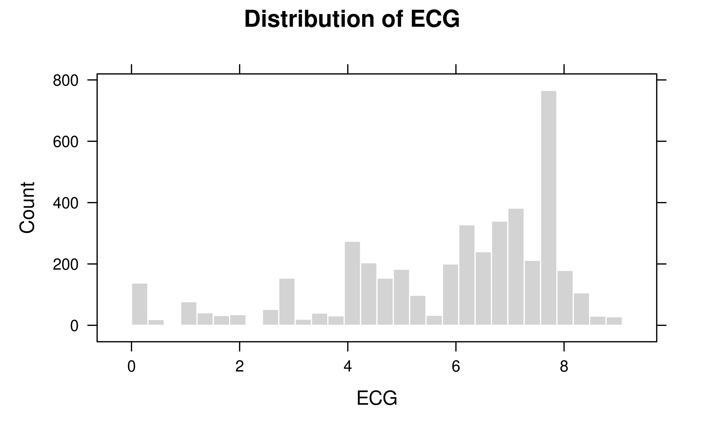
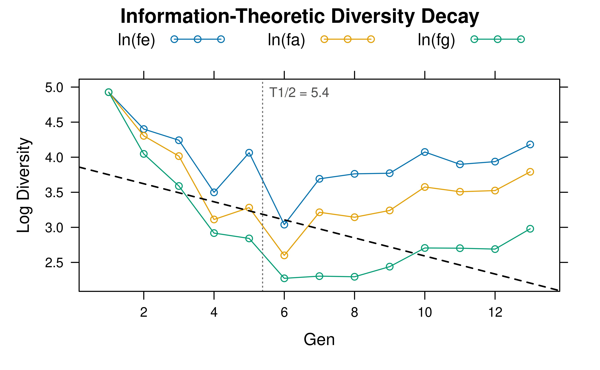
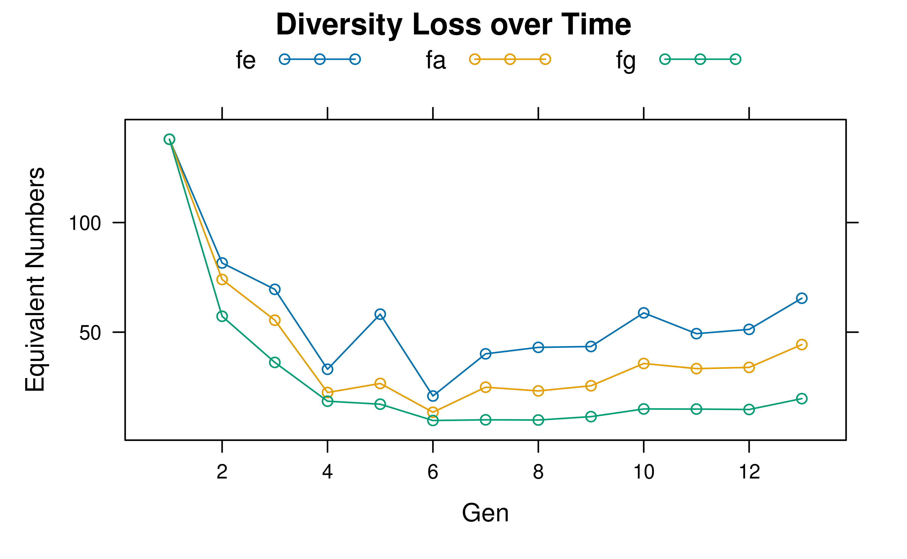

# 4. Pedigree Analysis and Population Genetics

This vignette summarizes a practical workflow for pedigree analysis with
`visPedigree`, with emphasis on the interpretation of the main
indicators used in breeding and conservation genetics.

The discussion is organized around five questions:

1.  How complete and deep is the pedigree?
2.  How long is the generation cycle?
3.  Has genetic diversity been eroded by unequal founder use,
    bottlenecks, or drift?
4.  How large is the effective population size under different
    definitions?
5.  Are relationship, inbreeding, subpopulation structure, and gene flow
    under control?

## 1. Setup and Data Preparation

Different package datasets are used for different analytical tasks.

- `deep_ped` is useful for pedigree depth and diversity summaries.
- `big_family_size_ped` contains a `Year` column and is suitable for
  generation intervals.
- `small_ped` is convenient for relationship examples.
- `inbred_ped` is convenient for inbreeding and classification examples.

``` r
library(visPedigree)
library(data.table)

data(deep_ped, package = "visPedigree")
data(big_family_size_ped, package = "visPedigree")
data(small_ped, package = "visPedigree")
data(inbred_ped, package = "visPedigree")

tp_deep <- tidyped(deep_ped)
tp_small <- tidyped(small_ped)
tp_inbred <- tidyped(inbred_ped)
```

## 2. Pedigree Overview with `pedstats()`

[`pedstats()`](https://luansheng.github.io/visPedigree/reference/pedstats.md)
provides a compact structural summary with three components:

- `$summary`: pedigree size and parental structure.
- `$ecg`: pedigree completeness and ancestral depth.
- `$gen_intervals`: generation intervals, only when a usable time column
  is available.

Here `deep_ped` has no explicit birth-date column. Accordingly,
[`pedstats()`](https://luansheng.github.io/visPedigree/reference/pedstats.md)
returns `$summary` and `$ecg`, whereas `$gen_intervals` remains `NULL`.

``` r
stats_deep <- pedstats(tp_deep)

stats_deep$summary
#>        N NSire  NDam NFounder MaxGen
#>    <int> <int> <int>    <int>  <int>
#> 1:  4399   483   554      138     13
tail(stats_deep$ecg)
#>         Ind      ECG FullGen MaxGen
#>      <char>    <num>   <num>  <num>
#> 1: K110997Q 7.616211       5     12
#> 2: K110997Z 6.722656       5     12
#> 3: K110998Q 4.606445       2     12
#> 4: K110998Z 6.417969       5     12
#> 5: K110999Q 7.345215       5     12
#> 6: K110999Z 6.875977       5     12
stats_deep$gen_intervals
#> NULL

# Visualize ancestral depth (Equivalent Complete Generations)
plot(stats_deep, type = "ecg", metric = "ECG")
```



Pedigree depth and pedigree time are related but distinct quantities.
The former is addressed by
[`pedecg()`](https://luansheng.github.io/visPedigree/reference/pedecg.md),
whereas the latter is addressed by
[`pedgenint()`](https://luansheng.github.io/visPedigree/reference/pedgenint.md).

## 3. Pedigree Completeness with `pedecg()`

Equivalent complete generations (ECG) summarize the amount of ancestral
information available for each individual:

$$ECG_{i} = \sum\limits_{j}\left( \frac{1}{2} \right)^{g_{ij}}$$

where $g_{ij}$ is the number of generations between individual $i$ and
ancestor $j$. ECG increases with both pedigree depth and pedigree
completeness.

In practice:

- `ECG` combines depth and completeness.
- `FullGen` counts how many fully known ancestral generations exist.
- `MaxGen` records the deepest known ancestral path.

`ECG` is especially useful because it provides the depth adjustment
required by realized effective population size estimators based on
inbreeding or coancestry.

``` r
ecg_deep <- pedecg(tp_deep)

ecg_deep[order(-ECG)][1:10]
#>          Ind      ECG FullGen MaxGen
#>       <char>    <num>   <num>  <num>
#>  1: K110034Q 9.078125       6     12
#>  2: K110052L 9.078125       6     12
#>  3: K110060H 9.078125       6     12
#>  4: K110069Z 9.078125       6     12
#>  5: K110097Q 9.078125       6     12
#>  6: K110118M 9.078125       6     12
#>  7: K110131M 9.078125       6     12
#>  8: K110138M 9.078125       6     12
#>  9: K110155M 9.078125       6     12
#> 10: K110165M 9.078125       6     12
```

## 4. Generation Intervals with `pedgenint()`

Generation interval is the age of a parent at the birth of its
offspring:

$$L = t_{offspring} - t_{parent}$$

[`pedgenint()`](https://luansheng.github.io/visPedigree/reference/pedgenint.md)
estimates this quantity for seven pathway summaries:

- `SS`, `SD`, `DS`, `DD`: sex-specific gametic pathways.
- `SO`, `DO`: sex-independent sire-offspring and dam-offspring pathways.
- `Average`: all parent-offspring pairs combined.

The function accepts `Date`/`POSIXct` columns, date strings, or numeric
years. When only an integer year is available, it is converted
internally to `YYYY-07-01` as a mid-year approximation.

``` r
tp_time <- tidyped(big_family_size_ped)

genint_year <- pedgenint(tp_time, timevar = "Year", unit = "year")
#> Numeric time column detected. Converting to Date (YYYY-07-01). For finer precision, convert to Date beforehand.
genint_year
#>    Pathway      N     Mean         SD
#>     <char>  <int>    <num>      <num>
#> 1: Average 280512 1.001093 0.03770707
#> 2:      DD    607 1.164398 0.37080261
#> 3:      DO 140256 1.001093 0.03770714
#> 4:      DS    507 1.196959 0.39776787
#> 5:      SD    607 1.164398 0.37080261
#> 6:      SO 140256 1.001093 0.03770714
#> 7:      SS    507 1.196959 0.39776787

# Visualize generation intervals
# Note: we can also use stats <- pedstats(tp_time, timevar = "Year") followed by plot(stats)
plot(genint_year)
```


The optional `cycle` parameter adds `GenEquiv`, which compares the
observed mean interval with a target breeding cycle:

$$GenEquiv_{i} = \frac{{\bar{L}}_{i}}{L_{cycle}}$$

Values larger than 1 indicate that the realized generation interval
exceeds the target cycle.

``` r
genint_cycle <- pedgenint(tp_time, timevar = "Year", unit = "year", cycle = 1.2)
#> Numeric time column detected. Converting to Date (YYYY-07-01). For finer precision, convert to Date beforehand.

genint_cycle[Pathway %in% c("SS", "SD", "DS", "DD", "Average")]
#>    Pathway      N     Mean         SD  GenEquiv
#>     <char>  <int>    <num>      <num>     <num>
#> 1: Average 280512 1.001093 0.03770707 0.8342445
#> 2:      DD    607 1.164398 0.37080261 0.9703321
#> 3:      DS    507 1.196959 0.39776787 0.9974660
#> 4:      SD    607 1.164398 0.37080261 0.9703321
#> 5:      SS    507 1.196959 0.39776787 0.9974660
```

## 5. Subpopulation Structure with `pedsubpop()`

Before interpreting diversity or relationship metrics, it is useful to
check whether the pedigree forms a single connected population or a
mixture of separate components.

[`pedsubpop()`](https://luansheng.github.io/visPedigree/reference/pedsubpop.md)
has two modes:

- `by = NULL`: summarize disconnected pedigree components.
- `by = "..."`: summarize the pedigree by an existing grouping variable.

``` r
ped_demo <- data.table(
  Ind = c("A", "B", "C", "D", "E", "F", "G", "H"),
  Sire = c(NA, NA, "A", NA, NA, "E", NA, NA),
  Dam  = c(NA, NA, "B", NA, NA, NA, NA, NA),
  Sex = c("male", "female", "male", "female", "male", "female", "male", "female"),
  Batch = c("L1", "L1", "L1", "L1", "L2", "L2", "L3", "L3")
)

tp_demo <- tidyped(ped_demo)

pedsubpop(tp_demo)
#>       Group     N N_Sire N_Dam N_Founder
#>      <char> <int>  <num> <num>     <int>
#> 1:      GP1     3      1     1         2
#> 2:      GP2     2      1     0         1
#> 3: Isolated     3      0     0         3
pedsubpop(tp_demo, by = "Batch")
#>     Group     N N_Sire N_Dam N_Founder
#>    <char> <int>  <int> <int>     <int>
#> 1:     L1     4      1     1         3
#> 2:     L3     2      0     0         2
#> 3:     L2     2      1     0         1
```

This is a compact summary tool. When the actual split pedigree objects
are needed for downstream analysis, use
[`splitped()`](https://luansheng.github.io/visPedigree/reference/splitped.md).

## 6. Diversity Indicators with `pediv()`

[`pediv()`](https://luansheng.github.io/visPedigree/reference/pediv.md)
is the integrated diversity summary. It combines:

- founder and ancestor contributions (`fe`, `fa`),
- founder genome equivalents (`fg`),
- three effective population size estimates (`Ne`).

All of these quantities depend on the definition of the **reference
population**. In the present example, the reference population is
defined as the most recent two generations in `deep_ped`.

``` r
ref_pop <- tp_deep[Gen >= max(Gen) - 1, Ind]
length(ref_pop)
#> [1] 3471
```

``` r
div_res <- pediv(tp_deep, reference = ref_pop, top = 10, seed = 42L)
#> Calculating founder and ancestor contributions...
#> Calculating founder contributions...
#> Calculating ancestor contributions (Boichard's iterative algorithm)...
#> Calculating Ne (coancestry) and fg...
#> Calculating Ne (inbreeding)...
#> Calculating Ne (demographic)...

div_res$summary
#>     NRef NFounder     feH       fe NAncestor     faH       fa     fafe       fg
#>    <int>    <int>   <num>    <num>     <int>   <num>    <num>    <num>    <num>
#> 1:  3471      157 92.0943 64.73344        94 60.1444 44.12033 0.681569 19.17965
#>     MeanCoan NSampledCoan NeCoancestry NeInbreeding NeDemographic
#>        <num>        <int>        <num>        <num>         <num>
#> 1: 0.0260693         1000     124.5124     98.00425      374.2021
div_res$ancestors
#>          Ind    Contrib CumContrib  Rank
#>       <char>      <num>      <num> <int>
#>  1: K500I804 0.05248848 0.05248848     1
#>  2: K60GXQ91 0.04525893 0.09774741     2
#>  3: K60NXQ91 0.04525893 0.14300634     3
#>  4: K600532I 0.04445765 0.18746399     4
#>  5: K700S069 0.03927182 0.22673581     5
#>  6: K900D251 0.03622875 0.26296456     6
#>  7: K700S011 0.02906223 0.29202679     7
#>  8: K700U416 0.02890017 0.32092697     8
#>  9: K700U650 0.02890017 0.34982714     9
#> 10: K500I869 0.02831497 0.37814211    10
```

### 6.1 `fe`, `fa`, and `fg`: what do they measure?

These three indicators describe diversity loss from complementary
angles.

#### Effective number of founders (`fe`)

$$f_{e} = \frac{1}{\sum\limits_{i = 1}^{f}p_{i}^{2}}$$

where $p_{i}$ is the expected contribution of founder $i$ to the
reference population. `fe` answers the question: if all founders had
contributed equally, how many founders would generate the same
diversity?

Use `fe` when the main concern is **unequal founder representation**.

#### Effective number of ancestors (`fa`)

$$f_{a} = \frac{1}{\sum\limits_{j = 1}^{a}q_{j}^{2}}$$

where $q_{j}$ is the **marginal** contribution of ancestor $j$ after
removing the contributions already explained by more influential
ancestors. `fa` is usually smaller than `fe` when bottlenecks occurred.

Use `fa` when the main concern is **genetic bottlenecks caused by a
limited set of influential ancestors**.

#### Founder genome equivalents (`fg`)

In its simplest interpretation,

$$f_{g} = \frac{1}{2\bar{C}}$$

where $\bar{C}$ is the mean coancestry of the reference population. In
`visPedigree`, `fg` is estimated from a diagonal-corrected mean
coancestry:

$$\widehat{\bar{C}} = \frac{N - 1}{N} \cdot \frac{{\bar{a}}_{off}}{2} + \frac{1 + \bar{F}}{2N}$$

$$f_{g} = \frac{1}{2\widehat{\bar{C}}}$$

where $N$ is the size of the full reference population,
${\bar{a}}_{off}$ is the mean off-diagonal additive relationship among
sampled individuals, and $\bar{F}$ is their mean inbreeding coefficient.

Use `fg` when the main concern is **the amount of founder genome still
surviving after unequal use, bottlenecks, and drift**. In practice, `fg`
is often the most conservative diversity indicator.

### 6.2 Shannon-entropy effective numbers: `feH` and `faH`

The classical `fe` and `fa` are based on $\sum p_{i}^{2}$ (Hill number
order $q = 2$), which is disproportionately influenced by a few large
contributions. `visPedigree` also reports the information-theoretic
counterpart at order $q = 1$, derived from Shannon entropy:

\$\$ f_e^{(H)} = \exp\\\Bigl(-\sum\_{i=1}^{f} p_i \ln p_i\Bigr), \qquad
f_a^{(H)} = \exp\\\Bigl(-\sum\_{j=1}^{a} q_j \ln q_j\Bigr) \$\$

All four metrics satisfy a strict monotone ordering:

$$N_{f} \geq f_{e}^{(H)} \geq f_{e},\qquad K \geq f_{a}^{(H)} \geq f_{a}$$

where $N_{f}$ is the total number of founders and $K$ is the number of
ancestors considered.

#### Metric guide

| Metric | Order   | Sensitivity                           | What it measures                                                                                                                                                                     |
|--------|---------|---------------------------------------|--------------------------------------------------------------------------------------------------------------------------------------------------------------------------------------|
| `fe`   | $q = 2$ | Dominated by common founders          | Effective number of founders if contributions were equalized. Dominated by the largest contributions; many rare founders with small $p_{i}$ have negligible influence on the metric. |
| `feH`  | $q = 1$ | Balanced; sensitive to rare founders  | Shannon-entropy effective founders. Counts rare founders more equitably than $q = 2$; always $\geq$`fe`.                                                                             |
| `fa`   | $q = 2$ | Dominated by common ancestors         | Effective number of ancestors accounting for bottleneck structure. Typically lower than `fe`.                                                                                        |
| `faH`  | $q = 1$ | Balanced; sensitive to rare ancestors | Shannon-entropy effective ancestors. Less dominated by the single most influential ancestor.                                                                                         |
| `fg`   | —       | Realized coancestry                   | Founder genome equivalents; the most conservative indicator because it captures drift as well.                                                                                       |

#### Interpreting the ratio $f_{e}^{(H)}/f_{e}$

The ratio $\rho = f_{e}^{(H)}/f_{e}$ is a **long-tail signal**:

- $\rho \approx 1$: founder contributions are already concentrated in a
  small number of individuals; there is no meaningful “hidden” diversity
  from minor founders.
- $\rho \gg 1$: many minor founders still carry genetic material into
  the reference population but are effectively invisible to the
  classical $f_{e}$ metric because their contributions are small. This
  situation is common early in a breeding programme when the pedigree is
  still shallow.

The analogous ratio $f_{a}^{(H)}/f_{a}$ diagnoses the same effect at the
**ancestor** level: a large ratio means that the bottleneck signal from
the dominant ancestor is masking genuine contributions from many
secondary ancestors.

#### Management implications

Use the two ratios together to set priorities:

1.  If $f_{e}^{(H)}/f_{e}$ is large but $f_{e}$ itself is already high,
    the programme has good founder coverage; no immediate action needed.
2.  If $f_{e}^{(H)}/f_{e}$ is large and $f_{e}$ is low, minor founders
    carry material that could be mobilized — consider deliberately
    increasing their representation in the next generation.
3.  If $f_{a}^{(H)}/f_{a}$ is large, secondary ancestors are still
    present but marginalized; diversifying sire selection could
    rebalance the gene pool before their lineages are lost entirely.

``` r
# Shannon metrics are included in pediv() output
div_res$summary[, .(NFounder, feH, fe, NAncestor, faH, fa)]
#>    NFounder     feH       fe NAncestor     faH       fa
#>       <int>   <num>    <num>     <int>   <num>    <num>
#> 1:      157 92.0943 64.73344        94 60.1444 44.12033

# The ratio feH/fe reveals long-tail founder diversity
div_res$summary[, .(rho_founder = feH / fe, rho_ancestor = faH / fa)]
#>    rho_founder rho_ancestor
#>          <num>        <num>
#> 1:     1.42267      1.36319
```

``` r
# pedcontrib() provides the same metrics via its summary
contrib_res <- pedcontrib(tp_deep, reference = ref_pop, mode = "both")
#> Calculating founder contributions...
#> Calculating ancestor contributions (Boichard's iterative algorithm)...
contrib_res$summary[c("n_founder", "f_e_H", "f_e", "n_ancestor", "f_a_H", "f_a")]
#> $n_founder
#> [1] 157
#> 
#> $f_e_H
#> [1] 92.0943
#> 
#> $f_e
#> [1] 64.73344
#> 
#> $n_ancestor
#> [1] 94
#> 
#> $f_a_H
#> [1] 60.1444
#> 
#> $f_a
#> [1] 44.12033
```

## 7. Diversity Dynamics over Time with `pedhalflife()`

[`pediv()`](https://luansheng.github.io/visPedigree/reference/pediv.md)
provides a static snapshot of diversity. When multiple time points
(generations, years, etc.) are available,
[`pedhalflife()`](https://luansheng.github.io/visPedigree/reference/pedhalflife.md)
tracks how $f_{e}$, $f_{a}$, and $f_{g}$ evolve and fits a log-linear
decay model to quantify the **rate of diversity loss**.

The total loss rate $\lambda_{total}$ is decomposed into three additive
components that each have a distinct biological meaning:

| Component  | Symbol        | Source of loss                |
|------------|---------------|-------------------------------|
| Foundation | $\lambda_{e}$ | Unequal founder contributions |
| Bottleneck | $\lambda_{b}$ | Overuse of key ancestors      |
| Drift      | $\lambda_{d}$ | Random sampling loss          |

The **diversity half-life** is the number of time units for $f_{g}$ to
halve: $$T_{1/2} = \frac{\ln 2}{\lambda_{total}}$$

``` r
hl <- pedhalflife(tp_deep, timevar = "Gen")
#> Calculating diversity across 13 time points...
print(hl)
#> Information-Theoretic Diversity Half-Life
#> -----------------------------------------
#> Total Loss Rate (lambda_total):   0.128778
#>   Foundation  (lambda_e)      :   0.034626
#>   Bottleneck  (lambda_b)      :   0.025217
#>   Drift       (lambda_d)      :   0.068935
#> -----------------------------------------
#> Diversity Half-life (T_1/2)   :       5.38 (Gen)
#> 
#> Timeseries: 13 time points
```

The printed half-life shows the unit in parentheses — `(Gen)` here —
taken directly from the `timevar` argument. The full object exposes
three components:

- `hl$timeseries` — per-time-point table (see column guide below).
- `hl$decay` — single-row table with `LambdaE`, `LambdaB`, `LambdaD`,
  `LambdaTotal`, and `THalf`.
- `hl$timevar` — the `timevar` string passed to the call.

### 7.1 Column guide for `$timeseries`

The cascade rests on a simple algebraic identity:

$$\ln f_{g} = \underset{\text{LnFe}}{\underbrace{\ln f_{e}}} + \underset{\text{LnFaFe}}{\underbrace{\ln\!\left( \frac{f_{a}}{f_{e}} \right)}} + \underset{\text{LnFgFa}}{\underbrace{\ln\!\left( \frac{f_{g}}{f_{a}} \right)}}$$

Because OLS is linear, the slope of $\ln f_{g}$ versus time equals the
sum of the slopes of the three right-hand terms. This guarantees exact
additivity: $\lambda_{total} = \lambda_{e} + \lambda_{b} + \lambda_{d}$.

| Column     | Formula                         | What it measures                                                                                                                                                                           |
|------------|---------------------------------|--------------------------------------------------------------------------------------------------------------------------------------------------------------------------------------------|
| `LnFe`     | $\ln f_{e}$                     | Log effective-founder diversity. Declines when founder contributions become more unequal over time.                                                                                        |
| `LnFa`     | $\ln f_{a}$                     | Log effective-ancestor diversity. Lies below `LnFe` whenever bottleneck ancestors have been over-used.                                                                                     |
| `LnFg`     | $\ln f_{g}$                     | Log founder-genome equivalents. The most comprehensive diversity signal; integrates founder use, bottlenecks, and drift.                                                                   |
| `LnFaFe`   | $\ln\left( f_{a}/f_{e} \right)$ | **Bottleneck gap.** When this ratio decreases over time, a small number of ancestors dominate the gene pool even beyond what unequal founder use would predict.                            |
| `LnFgFa`   | $\ln\left( f_{g}/f_{a} \right)$ | **Drift gap.** Captures random allele loss due to finite population size. Because $f_{g} \leq f_{a}$ always, this term is $\leq 0$ and becomes more negative as genetic drift accumulates. |
| `TimeStep` | numeric                         | OLS time axis (same as `Time` for numeric `timevar`; sequential indices otherwise).                                                                                                        |

### 7.2 Interpreting the $\lambda$ components

The negative OLS slope of each log column gives the corresponding loss
rate. All three terms have a distinct policy implication:

**$\lambda_{e}$ (Foundation)** — rate of increase in
founder-contribution inequality. A large $\lambda_{e}$ suggests that
founder representation is still diverging, possibly because some
founders are reaching later generations through many more breeding
pathways than others. Remedy: broaden founder use in the breeding
programme.

**$\lambda_{b}$ (Bottleneck)** — rate at which a few key ancestors
capture an ever-larger share of the gene pool beyond what founder
inequality alone explains. A large $\lambda_{b}$ points to systematic
over-selection of certain families or sires. Remedy: restrict the number
of offspring per high-ranking animal; rotate breeding males.

**$\lambda_{d}$ (Drift)** — rate of random allele loss in finite
populations. This component is always present and increases with small
effective population size. It is the only component that cannot be
reversed by changing selection decisions; it can only be slowed by
maintaining a larger breeding population or by cryopreservation of
genetic material.

When $\lambda_{d} \gg \lambda_{e} + \lambda_{b}$ (as in the example
above), drift is the dominant driver of diversity loss and should be the
primary management target.

### 7.3 Interpreting $T_{1/2}$

$T_{1/2}$ is the number of time units (generations, years, etc.)
required for $f_{g}$ to fall to half its current value, assuming the
observed decay rate continues. It is a single headline figure that
combines all three loss channels.

As a rough benchmark: a half-life shorter than five to ten generations
is generally considered a cause for concern in conservation and
aquaculture genetics. Breed registries and conservation programmes often
use $T_{1/2}$ as a threshold indicator for triggering corrective
management.

``` r
hl$timeseries
#>      Time  NRef        fe        fa         fg     lnfe     lnfa     lnfg
#>     <int> <int>     <num>     <num>      <num>    <num>    <num>    <num>
#>  1:     1   138 138.00000 138.00000 138.000000 4.927254 4.927254 4.927254
#>  2:     2    96  81.55752  74.02410  57.242236 4.401309 4.304391 4.047292
#>  3:     3    74  69.53651  55.45316  36.204959 4.241852 4.015539 3.589196
#>  4:     4    91  33.07439  22.47218  18.505028 3.498759 3.112278 2.918042
#>  5:     5    95  58.21114  26.60280  17.148880 4.064077 3.281016 2.841933
#>  6:     6   119  20.87729  13.46723   9.709381 3.038662 2.600259 2.273093
#>  7:     7    37  40.12238  24.89445  10.016763 3.691934 3.214645 2.304260
#>  8:     8    41  43.07344  23.20121   9.927020 3.762907 3.144204 2.295260
#>  9:     9    51  43.45747  25.55284  11.468733 3.771783 3.240749 2.439624
#> 10:    10    78  58.80040  35.70455  14.967166 4.074149 3.575278 2.705859
#> 11:    11   108  49.32442  33.37264  14.920611 3.898419 3.507737 2.702744
#> 12:    12   209  51.27256  33.93121  14.728712 3.937156 3.524335 2.689799
#> 13:    13  3262  65.47682  44.33880  19.682156 4.181696 3.791860 2.979712
#>         lnfafe     lnfgfa TimeStep
#>          <num>      <num>    <num>
#>  1:  0.0000000  0.0000000        1
#>  2: -0.0969179 -0.2570986        2
#>  3: -0.2263131 -0.4263427        3
#>  4: -0.3864809 -0.1942358        4
#>  5: -0.7830602 -0.4390836        5
#>  6: -0.4384028 -0.3271666        6
#>  7: -0.4772897 -0.9103847        7
#>  8: -0.6187023 -0.8489440        8
#>  9: -0.5310341 -0.8011241        9
#> 10: -0.4988704 -0.8694193       10
#> 11: -0.3906828 -0.8049930       11
#> 12: -0.4128205 -0.8345365       12
#> 13: -0.3898361 -0.8121477       13
```

To focus on a specific time window, pass the desired values to the `at`
argument:

``` r
hl_recent <- pedhalflife(tp_deep, timevar = "Gen",
                         at = tail(sort(unique(tp_deep$Gen)), 4))
#> Calculating diversity across 4 time points...
print(hl_recent)
#> Information-Theoretic Diversity Half-Life
#> -----------------------------------------
#> Total Loss Rate (lambda_total):  -0.077122
#>   Foundation  (lambda_e)      :  -0.036138
#>   Bottleneck  (lambda_b)      :  -0.030497
#>   Drift       (lambda_d)      :  -0.010487
#> -----------------------------------------
#> Diversity Half-life (T_1/2)   : NA
#> 
#> Timeseries: 4 time points
```

Plotting the object shows the log-linear decay of each diversity metric:

``` r
plot(hl, type = "log")
```



A `type = "raw"` plot shows the equivalent numbers on the original
scale:

``` r
plot(hl, type = "raw")
```



## 8. Effective Population Size with `pedne()` and `pediv()`

[`pediv()`](https://luansheng.github.io/visPedigree/reference/pediv.md)
reports three complementary effective population size definitions. Each
addresses a distinct biological question.

### 8.1 Demographic `Ne`

$$N_{e} = \frac{4N_{m}N_{f}}{N_{m} + N_{f}}$$

where $N_{m}$ and $N_{f}$ are the numbers of contributing males and
females. This is the easiest estimate to understand, but it ignores
realized pedigree structure, inbreeding, and drift. It is therefore
often optimistic.

### 8.2 Inbreeding `Ne`

$$\Delta F_{i} = 1 - \left( 1 - F_{i} \right)^{1/{(ECG_{i} - 1)}}$$

$$N_{e} = \frac{1}{2\overline{\Delta F}}$$

This estimator uses the realized rate of inbreeding. `ECG` standardizes
individuals with different pedigree depths. Use this estimate when the
primary concern is **the rate of inbreeding accumulation**.

### 8.3 Coancestry `Ne`

$$\Delta c_{ij} = 1 - \left( 1 - c_{ij} \right)^{1/{(\frac{ECG_{i} + ECG_{j}}{2})}}$$

$$N_{e} = \frac{1}{2\overline{\Delta c}}$$

This estimator is based on the rate of coancestry among members of the
reference population. Because it captures the accumulation of
relatedness before it is fully expressed as realized inbreeding, it is
often the strictest and most sensitive warning signal in managed
breeding populations.

## 9. Average Relationship Trends with `pedrel()`

[`pedrel()`](https://luansheng.github.io/visPedigree/reference/pedrel.md)
summarizes pairwise relatedness within groups. Two complementary scales
are available via the `scale` argument.

### 9.1 Mean additive relationship (`scale = "relationship"`)

The default scale returns the mean off-diagonal additive relationship:

$$MeanRel = \frac{1}{n(n - 1)}\sum\limits_{i \neq j}a_{ij}$$

where $a_{ij} = 2c_{ij}$ is the additive relationship and $c_{ij}$ is
the coancestry (kinship coefficient) between individuals $i$ and $j$. A
higher `MeanRel` means that individuals within the group are, on
average, more related by descent.

``` r
tp_small$BirthYear <- 2010 + tp_small$Gen

rel_by_gen <- pedrel(tp_small, by = "Gen")
rel_by_gen
#>      Gen NTotal NUsed   MeanRel
#>    <int>  <int> <int>     <num>
#> 1:     1      9     9 0.0000000
#> 2:     2      5     5 0.2000000
#> 3:     3      7     7 0.1547619
#> 4:     4      3     3 0.1145833
#> 5:     5      2     2 0.0468750
#> 6:     6      2     2 0.5507812
```

The `reference` argument lets you focus on a subset of interest inside
each group, such as candidate breeders.

``` r
ref_ids <- c("Z1", "Z2", "X", "Y")

pedrel(tp_small, by = "Gen", reference = ref_ids)
#> Warning in FUN(X[[i]], ...): Group '1' has less than 2 individuals after
#> applying 'reference', returning NA_real_.
#> Warning in FUN(X[[i]], ...): Group '2' has less than 2 individuals after
#> applying 'reference', returning NA_real_.
#> Warning in FUN(X[[i]], ...): Group '3' has less than 2 individuals after
#> applying 'reference', returning NA_real_.
#> Warning in FUN(X[[i]], ...): Group '4' has less than 2 individuals after
#> applying 'reference', returning NA_real_.
#>      Gen NTotal NUsed   MeanRel
#>    <int>  <int> <int>     <num>
#> 1:     1      9     0        NA
#> 2:     2      5     0        NA
#> 3:     3      7     0        NA
#> 4:     4      3     0        NA
#> 5:     5      2     2 0.0468750
#> 6:     6      2     2 0.5507812
```

### 9.2 Corrected mean coancestry (`scale = "coancestry"`)

When `scale = "coancestry"`,
[`pedrel()`](https://luansheng.github.io/visPedigree/reference/pedrel.md)
returns the diagonal-corrected population mean coancestry following
Caballero & Toro (2000):

$$\bar{C} = \frac{N - 1}{N} \cdot \frac{{\bar{a}}_{off}}{2} + \frac{1 + \bar{F}}{2N}$$

where ${\bar{a}}_{off}$ is the mean off-diagonal relationship, $\bar{F}$
is the mean inbreeding coefficient of the group, and $N$ is the group
size. This $\bar{C}$ accounts for self-coancestry within the group and
matches the internal coancestry quantity used by
[`pediv()`](https://luansheng.github.io/visPedigree/reference/pediv.md)
to derive $f_{g}$.

``` r
coan_by_gen <- pedrel(tp_small, by = "Gen", scale = "coancestry")
coan_by_gen
#>      Gen NTotal NUsed   MeanCoan
#>    <int>  <int> <int>      <num>
#> 1:     1      9     9 0.05555556
#> 2:     2      5     5 0.18000000
#> 3:     3      7     7 0.13775510
#> 4:     4      3     3 0.20833333
#> 5:     5      2     2 0.27148438
#> 6:     6      2     2 0.39550781
```

Use `scale = "relationship"` to track mean pairwise relatedness trends.
Use `scale = "coancestry"` when you need a population-level coancestry
consistent with diversity metrics from
[`pediv()`](https://luansheng.github.io/visPedigree/reference/pediv.md).

`MeanRel` and coancestry-based `Ne` are conceptually linked, but they
are not identical summaries. `MeanRel` is an average additive
relationship within a group, whereas coancestry-based `Ne` is derived
from the *rate of increase* in coancestry across pedigree depth.

## 10. Inbreeding Trends with `inbreed()` and `pedfclass()`

Wright’s inbreeding coefficient $F$ is the probability that the two
alleles of an individual are identical by descent. A practical starting
point is to inspect the mean trend by generation.

``` r
tp_inbred_f <- inbreed(tp_inbred)

f_trend <- tp_inbred_f[, .(MeanF = mean(f, na.rm = TRUE)), by = Gen]
f_trend
#>      Gen  MeanF
#>    <int>  <num>
#> 1:     1 0.0000
#> 2:     2 0.0000
#> 3:     3 0.2500
#> 4:     4 0.2500
#> 5:     5 0.4375
```

For classification by inbreeding severity,
[`pedfclass()`](https://luansheng.github.io/visPedigree/reference/pedfclass.md)
can be applied directly to the pedigree object. If the inbreeding
coefficient is not yet present, the function computes it internally.

``` r
pedfclass(tp_inbred)
#> Calculating inbreeding coefficients...
#> Key: <FClass>
#>                 FClass Count Percentage
#>                  <ord> <int>      <num>
#> 1:               F = 0     4   57.14286
#> 2:     0 < F <= 0.0625     0    0.00000
#> 3: 0.0625 < F <= 0.125     0    0.00000
#> 4:   0.125 < F <= 0.25     2   28.57143
#> 5:            F > 0.25     1   14.28571
```

Custom reporting thresholds can be supplied through `breaks`.

``` r
pedfclass(tp_inbred, breaks = c(0.03125, 0.0625, 0.125, 0.25))
#> Calculating inbreeding coefficients...
#> Key: <FClass>
#>                   FClass Count Percentage
#>                    <ord> <int>      <num>
#> 1:                 F = 0     4   57.14286
#> 2:      0 < F <= 0.03125     0    0.00000
#> 3: 0.03125 < F <= 0.0625     0    0.00000
#> 4:   0.0625 < F <= 0.125     0    0.00000
#> 5:     0.125 < F <= 0.25     2   28.57143
#> 6:              F > 0.25     1   14.28571
```

The default thresholds correspond approximately to familiar pedigree
scenarios:

- $F = 0.0625$: half-sib mating.
- $F = 0.125$: avuncular or grandparent-grandchild mating.
- $F = 0.25$: full-sib or parent-offspring mating.

## 11. Gene Flow and Partial Inbreeding

### 11.1 `pedancestry()`: founder-line proportions

[`pedancestry()`](https://luansheng.github.io/visPedigree/reference/pedancestry.md)
tracks how founder groups contribute to later descendants. This is
useful when founders are labeled by line, strain, or geographic origin.

``` r
ped_line <- data.table(
  Ind = c("A", "B", "C", "D", "E", "F", "G"),
  Sire = c(NA, NA, NA, NA, "A", "C", "E"),
  Dam  = c(NA, NA, NA, NA, "B", "D", "F"),
  Sex = c("male", "female", "male", "female", "male", "female", "male"),
  Line = c("Line1", "Line1", "Line2", "Line2", NA, NA, NA)
)

tp_line <- tidyped(ped_line)

anc <- pedancestry(tp_line, foundervar = "Line")
anc
#>       Ind Line1 Line2
#>    <char> <num> <num>
#> 1:      A   1.0   0.0
#> 2:      B   1.0   0.0
#> 3:      C   0.0   1.0
#> 4:      D   0.0   1.0
#> 5:      E   1.0   0.0
#> 6:      F   0.0   1.0
#> 7:      G   0.5   0.5
```

### 11.2 `pedpartial()`: which ancestors explain inbreeding?

[`pedpartial()`](https://luansheng.github.io/visPedigree/reference/pedpartial.md)
decomposes total inbreeding into contributions from selected ancestors.
It is useful for identifying which ancestors are most responsible for
the observed inbreeding.

``` r
partial_f <- pedpartial(tp_inbred, ancestors = c("A", "B"))
#> Calculating partial inbreeding for 2 ancestors...
partial_f
#>       Ind       A       B
#>    <char>   <num>   <num>
#> 1:      A 0.00000 0.00000
#> 2:      B 0.00000 0.00000
#> 3:      C 0.00000 0.00000
#> 4:      D 0.00000 0.00000
#> 5:      E 0.12500 0.12500
#> 6:      F 0.00000 0.25000
#> 7:      G 0.15625 0.28125
```

## 12. Practical Interpretation

One useful interpretation order is:

1.  Check pedigree depth and completeness with
    [`pedecg()`](https://luansheng.github.io/visPedigree/reference/pedecg.md).
2.  Check generation timing with
    [`pedgenint()`](https://luansheng.github.io/visPedigree/reference/pedgenint.md).
3.  Quantify static diversity with `fe`, `fa`, and `fg` via
    [`pediv()`](https://luansheng.github.io/visPedigree/reference/pediv.md);
    compare with `feH` and `faH` to assess long-tail founder value.
4.  Track diversity dynamics over time with
    [`pedhalflife()`](https://luansheng.github.io/visPedigree/reference/pedhalflife.md).
    Inspect $\lambda_{e}$, $\lambda_{b}$, and $\lambda_{d}$ to identify
    the dominant driver of loss; use $T_{1/2}$ as a headline indicator
    for management reporting.
5.  Compare demographic, inbreeding, and coancestry-based `Ne`.
6.  Monitor `MeanRel` and `MeanF` over time.
7.  Use
    [`pedsubpop()`](https://luansheng.github.io/visPedigree/reference/pedsubpop.md),
    [`pedancestry()`](https://luansheng.github.io/visPedigree/reference/pedancestry.md),
    and
    [`pedpartial()`](https://luansheng.github.io/visPedigree/reference/pedpartial.md)
    to diagnose structure, introgression, and bottlenecks.

## References

- Boichard, D., Maignel, L., & Verrier, É. (1997). The value of using
  probabilities of gene origin to measure genetic variability in a
  population. *Genetics Selection Evolution*, 29(1), 5-23.
- Caballero, A., & Toro, M. A. (2000). Interrelations between effective
  population size and other pedigree tools for the management of
  conserved populations. *Genetical Research*, 75(3), 331-343.
- Cervantes, I., Goyache, F., Molina, A., Valera, M., & Gutiérrez, J. P.
  (2011). Estimation of effective population size from the rate of
  coancestry in pedigreed populations. *Journal of Animal Breeding and
  Genetics*, 128(1), 56-63.
- Gutiérrez, J. P., Cervantes, I., Molina, A., Valera, M., & Goyache, F.
  (2008). Individual increase in inbreeding allows estimating effective
  sizes from pedigrees. *Genetics Selection Evolution*, 40(4), 359-378.
- Gutiérrez, J. P., Cervantes, I., & Goyache, F. (2009). Improving the
  estimation of realized effective population sizes in farm animals.
  *Journal of Animal Breeding and Genetics*, 126(4), 327-332.
- Hill, M. O. (1973). Diversity and evenness: a unifying notation and
  its consequences. *Ecology*, 54(2), 427-432.
- Jost, L. (2006). Entropy and diversity. *Oikos*, 113(2), 363-375.
- Lacy, R. C. (1989). Analysis of founder representation in pedigrees:
  founder equivalents and founder genome equivalents. *Zoo Biology*,
  8(2), 111-123.
- Wright, S. (1922). Coefficients of inbreeding and relationship. *The
  American Naturalist*, 56(645), 330-338.
- Wright, S. (1931). Evolution in Mendelian populations. *Genetics*,
  16(2), 97-159.
