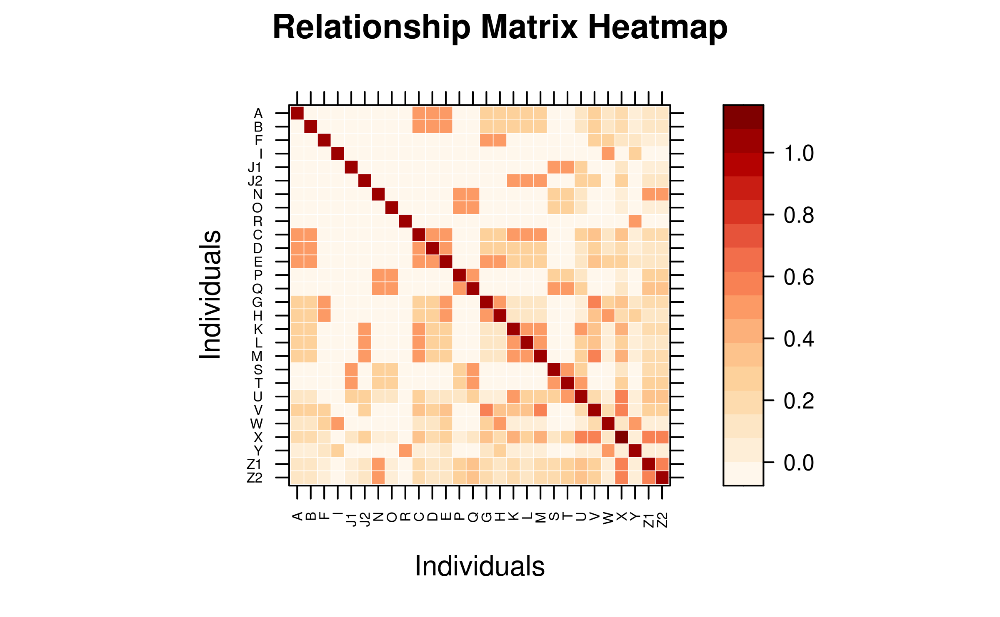
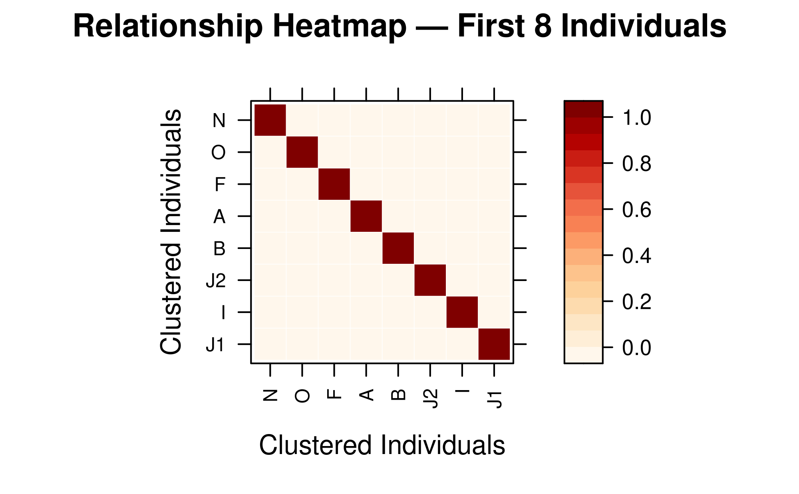
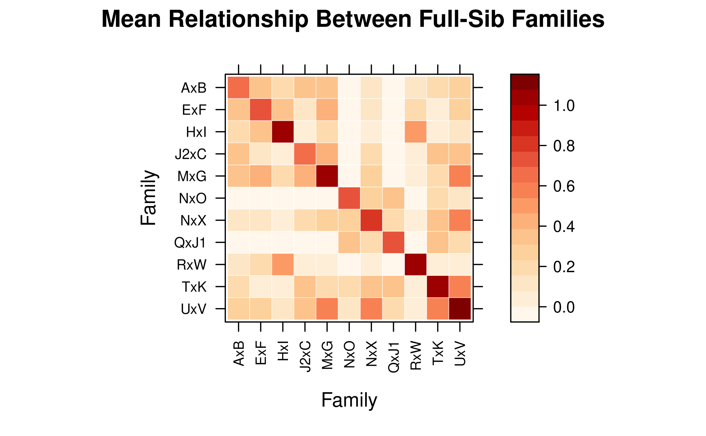
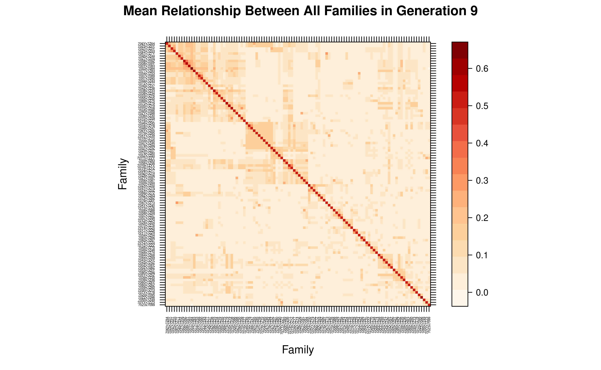

# 5. Calculation and visualization of relationship matrix

1.  [Calculating Relationship Matrices with pedmat()](#id_1)  
    1.1 [Supported Methods](#id_1-1)  
    1.2 [Basic Usage](#id_1-2)  
    1.3 [Sparse Matrix Representation](#id_1-3)  
2.  [Matrix-Free Products with pedprod()](#id_2)  
    2.1 [When to Use pedprod vs pedmat](#id_2-1)  
    2.2 [Basic Usage — $`Ax`$ (vector)](#id_2-2)  
    2.3 [Products with $`A^{-1}`$](#id_2-3)  
    2.4 [Multiple Contribution Schemes — $`AX`$](#id_2-4)  
    2.5 [Practical Use Cases](#id_2-5)  
    2.6 [Performance and Scalability](#id_2-6)  
3.  [Inspecting the Matrix](#id_3)  
    3.1 [Summary Statistics](#id_3-1)  
    3.2 [Querying Specific Relationships](#id_3-2)  
4.  [Compact Mode for Large Pedigrees](#id_4)  
    4.1 [Using compact = TRUE](#id_4-1)  
    4.2 [Expanding and Querying Compacted Matrices](#id_4-2)  
    4.3 [When to Use Compact Mode](#id_4-3)  
5.  [Visualizing Relationship Matrices with vismat()](#id_5)  
    5.1 [Relationship Heatmaps](#id_5-1)  
    5.2 [Inbreeding and Kinship Histograms](#id_5-2)  
6.  [Performance Considerations](#id_6)

Relationship matrices are fundamental tools in quantitative genetics and
animal breeding. They quantify the genetic similarity between
individuals due to shared ancestry, which is essential for estimating
breeding values (BLUP) and managing genetic diversity. The `visPedigree`
package provides efficient tools for calculating various relationship
matrices and visualizing them through heatmaps and histograms.

## 1. Calculating Relationship Matrices with `pedmat()`

The
[`pedmat()`](https://luansheng.github.io/visPedigree/reference/pedmat.md)
function is the primary tool for calculating relationship matrices. It
supports both additive and dominance relationship matrices, as well as
their inverses. The inverse additive relationship matrix (`Ainv`)
follows Henderson’s rules (Henderson, 1976), while inbreeding
coefficients use the same optimized recursive engine as
[`inbreed()`](https://luansheng.github.io/visPedigree/reference/inbreed.md),
based on algorithms for large populations described by Meuwissen & Luo
(1992) and Sargolzaei et al. (2005).

### 1.1 Supported Methods

The `method` parameter in
[`pedmat()`](https://luansheng.github.io/visPedigree/reference/pedmat.md)
determines the type of matrix to calculate:

- **“A”**: Additive relationship matrix (Numerator Relationship Matrix).
- **“Ainv”**: Inverse of the additive relationship matrix.
- **“D”**: Dominance relationship matrix.
- **“Dinv”**: Inverse of the dominance relationship matrix.
- **“AA”**: Additive-by-additive (epistatic) relationship matrix.
- **“AAinv”**: Inverse of the epistatic relationship matrix.
- **“f”**: Inbreeding coefficients vector (uses the same optimized
  engine as `tidyped(..., inbreed = TRUE)`).

### 1.2 Basic Usage

Most calculations require a pedigree tidied by
[`tidyped()`](https://luansheng.github.io/visPedigree/reference/tidyped.md).

``` r

# Load example pedigree and tidy it
data(small_ped)
tped <- tidyped(small_ped)

# Calculate Additive Relationship Matrix (A)
mat_A <- pedmat(tped, method = "A")

# Calculate Dominance Relationship Matrix (D)
mat_D <- pedmat(tped, method = "D")

# Calculate inbreeding coefficients (f)
vec_f <- pedmat(tped, method = "f")
```

### 1.3 Sparse Matrix Representation

By default,
[`pedmat()`](https://luansheng.github.io/visPedigree/reference/pedmat.md)
returns a sparse matrix (class `dsCMatrix` from the `Matrix` package)
for relationship matrices. This is highly memory-efficient for large
pedigrees where many individuals are unrelated.

``` r

class(mat_A)
#> [1] "dgeMatrix"
#> attr(,"package")
#> [1] "Matrix"
```

## 2. Matrix-Free Products with `pedprod()`

For small and moderate pedigrees, matrices returned by
[`pedmat()`](https://luansheng.github.io/visPedigree/reference/pedmat.md)
are ordinary matrix-like R objects and can be used directly with R’s
`%*%`. For large pedigrees, however, forming the dense additive
relationship matrix can be the dominant memory cost.
[`pedprod()`](https://luansheng.github.io/visPedigree/reference/pedprod.md)
instead computes $`Ax`$, $`AX`$, $`A^{-1}x`$, or $`A^{-1}X`$ directly
from the pedigree — without ever constructing the $`n \times n`$
relationship matrix.

The implementation uses the pedigree factorization $`A = TDT'`$
(Colleau, 2002), where $`T`$ is the transmission matrix and $`D`$ is the
diagonal matrix of Mendelian sampling variances. The product is computed
through backward and forward pedigree traversals in $`O(np)`$ time for
an $`n \times p`$ right-hand side, with $`O(np)`$ working memory — a
fraction of the $`O(n^2)`$ storage that a dense $`A`$ would require.

### 2.1 When to Use `pedprod` vs `pedmat`

| Use [`pedprod()`](https://luansheng.github.io/visPedigree/reference/pedprod.md) when … | Use [`pedmat()`](https://luansheng.github.io/visPedigree/reference/pedmat.md) when … |
|:---|:---|
| You only need matrix-vector products ($`Ax`$, $`A^{-1}x`$) | You need individual relationship coefficients |
| The pedigree has \>10 000 individuals | The pedigree is small enough that $`A`$ fits in memory |
| You are iterating (e.g., BLUP, OCS, MCMC) | You need the matrix for visualization or inspection |
| Memory is the bottleneck | You need $`D`$, $`AA`$, or dominance matrices |
| You are working with $`A^{-1}`$ products for mixed models | You need to query specific pairwise relationships |

The two functions are complementary:
[`pedmat()`](https://luansheng.github.io/visPedigree/reference/pedmat.md)
gives you the full matrix when you need to examine it;
[`pedprod()`](https://luansheng.github.io/visPedigree/reference/pedprod.md)
applies the matrix implicitly when you only need its action on vectors.

### 2.2 Basic Usage — $`A x`$ (vector)

The most common use is computing the additive relationship of every
individual to a weighted group — for example, a set of selection
candidates.

``` r

# Load example pedigree and tidy it
data(small_ped)
tped <- tidyped(small_ped)

# Equal contributions from two candidates; other individuals have zero weight
weights <- c(Z1 = 0.5, Z2 = 0.5)

# Relationship of every pedigree individual to the weighted candidate group
Ax <- pedprod(tped, weights)
head(Ax)
#>       A       B       F       I      J1      J2 
#> 0.09375 0.09375 0.06250 0.00000 0.06250 0.12500

# Average additive relationship c' A c and average coancestry
mean_relationship <- sum(weights * Ax[names(weights)])
mean_coancestry <- mean_relationship / 2
c(mean_relationship = mean_relationship, mean_coancestry = mean_coancestry)
#> mean_relationship   mean_coancestry 
#>         0.7910156         0.3955078
```

**Named vs unnamed vectors.** When `x` is named, individuals not listed
automatically receive value zero — you do not need to pad the vector
yourself. An unnamed vector must have exactly one entry per pedigree
individual in `IndNum` order:

``` r

# Named: only listed individuals get non-zero values
named_x <- c(Z1 = 0.3, Z2 = 0.4, A = 0.3)
pedprod(tped, named_x)[1:6]  # B, C, etc. are automatically zero
#>        A        B        F        I       J1       J2 
#> 0.365625 0.065625 0.043750 0.000000 0.043750 0.087500

# Unnamed: must match the pedigree size
unnamed_x <- rep(1, nrow(tped))
length(pedprod(tped, unnamed_x))
#> [1] 28
```

Input validation catches common mistakes: duplicate or unknown IDs,
missing values, and non-finite entries are all rejected with informative
messages.

### 2.3 Products with $`A^{-1}`$

The inverse additive relationship matrix $`A^{-1}`$ is fundamental in
mixed model equations (Henderson’s BLUP).
[`pedprod()`](https://luansheng.github.io/visPedigree/reference/pedprod.md)
computes $`A^{-1}x`$ and $`A^{-1}X`$ efficiently using Henderson’s rules
without forming the $`n \times n`$ matrix:

``` r

# Ainv * vector
x <- rnorm(nrow(tped))
Ainv_x <- pedprod(tped, x, method = "Ainv")
head(Ainv_x)
#>           A           B           F           I          J1          J2 
#> -2.90971042 -1.25434985 -2.89496064 -1.67763900  0.05803645  2.47858892

# Verify against explicit computation (small pedigree only)
A <- pedmat(tped, method = "A", sparse = FALSE)
Ainv <- pedmat(tped, method = "Ainv", sparse = FALSE)
all.equal(
  unname(Ainv_x),
  unname(drop(Ainv %*% x)),
  tolerance = 1e-12
)
#> [1] TRUE
```

For large pedigrees where explicit inversion is impossible,
`pedprod(tped, x, method = "Ainv")` remains computationally feasible.
The numerical equivalence with the full matrix can be verified on a
small pedigree:

``` r

# Ainv * (A * x) should recover x (to machine precision)
A_x <- pedprod(tped, x, method = "A")
Ainv_Ax <- pedprod(tped, A_x, method = "Ainv")
all.equal(unname(Ainv_Ax), unname(x), tolerance = 1e-12)
#> [1] TRUE
```

### 2.4 Multiple Contribution Schemes — $`A X`$

When `x` is a matrix,
[`pedprod()`](https://luansheng.github.io/visPedigree/reference/pedprod.md)
computes all columns in a single backward/ forward traversal of the
pedigree. This is significantly more efficient than calling
[`pedprod()`](https://luansheng.github.io/visPedigree/reference/pedprod.md)
repeatedly for each column.

``` r

# Three ways to weight the SAME two candidates (Z1 and Z2 are full sibs)
schemes <- cbind(
  Equal      = c(Z1 = 0.5, Z2 = 0.5),
  Z1_only    = c(Z1 = 1.0, Z2 = 0.0),
  Weighted   = c(Z1 = 0.7, Z2 = 0.3)
)
AX <- pedprod(tped, schemes)

# The schemes diverge at the candidates themselves (and their descendants);
# a shared ancestor is equally related to any weighting of two full sibs.
AX[c("Z1", "Z2"), ]
#>        Equal   Z1_only  Weighted
#> Z1 0.7910156 1.0312500 0.8871094
#> Z2 0.7910156 0.5507812 0.6949219

# Expected average relationship within each contributing group, 0.5 * c'A c.
# Under random mating this equals the mean inbreeding of the resulting progeny.
group_coancestry <- 0.5 * colSums(schemes * AX[rownames(schemes), ])
round(group_coancestry, 5)
#>    Equal  Z1_only Weighted 
#>  0.39551  0.51562  0.41473
```

The three schemes draw on the same two full sibs, yet the genetic
consequence differs sharply. Concentrating all contribution on a single
animal (`Z1_only`) exposes its full, partly inbred genome and inflates
the group’s expected progeny inbreeding to 0.516, whereas spreading
contribution evenly (`Equal`) drives it down to 0.396. Trading a little
short-term gain for a lower average relationship is exactly the balance
struck by optimal contribution selection.
[`pedprod()`](https://luansheng.github.io/visPedigree/reference/pedprod.md)
supplies the underlying $`c'A c`$ evaluation for every candidate column
in a single $`O(np)`$ traversal — compared to $`O(p \cdot n^2)`$ for
explicit products with a precomputed $`A`$ — and never forms $`A`$
itself.

### 2.5 Practical Use Cases

#### Optimal Contribution Selection (OCS)

OCS maximizes genetic gain while constraining inbreeding. The core
computation repeatedly evaluates $`c'A c`$ for candidate contribution
vectors $`c`$:

``` r

# Weighted candidate contributions
candidates <- setNames(c(0.25, 0.25, 0.25, 0.25), c("Z1", "Z2", "A", "B"))
Ac <- pedprod(tped, candidates)

# Average coancestry of the selected group: 0.5 * c' A c
c_accepted <- sum(candidates * Ac[names(candidates)]) / 2
c_accepted
#> [1] 0.1848145
```

With
[`pedprod()`](https://luansheng.github.io/visPedigree/reference/pedprod.md),
this evaluation is fast enough to be embedded inside an iterative
optimization loop over thousands of candidate configurations.

#### Mixed Model Equations

The mixed model equations for BLUP require products $`A^{-1} u`$ and
$`A^{-1} Z`$. For an $`n \times p`$ design matrix $`Z`$, use:

``` r

# Simulated breeding values as a matrix right-hand side
set.seed(20260704)
Z_design <- cbind(
  trait1 = rnorm(nrow(tped)),
  trait2 = rnorm(nrow(tped))
)
rownames(Z_design) <- tped$Ind

# Ainv * Z in one traversal — no Ainv ever stored
Ainv_Z <- pedprod(tped, Z_design, method = "Ainv")
dim(Ainv_Z)
#> [1] 28  2
Ainv_Z[1:5, ]
#>       trait1     trait2
#> A  -2.731207 -1.7418085
#> B  -1.352460 -1.5616321
#> F   4.209353 -2.7144441
#> I  -1.330313  0.4133992
#> J1 -2.663064 -0.7030142
```

#### Founder Contribution Analysis

Isolating one founder at a time turns
[`pedprod()`](https://luansheng.github.io/visPedigree/reference/pedprod.md)
into a founder-origin decomposition: the product $`A e_f`$ (a unit
vector on founder $`f`$) returns that founder’s expected genetic
contribution to every individual. Stacking the unit vectors into a
matrix decomposes the whole population in one traversal, exposing which
founders dominate the current gene pool and which have been lost:

``` r

# One unit contribution vector per founder: column f isolates founder f
founder_ids <- tped[Gen == 1, Ind]
founder_design <- diag(length(founder_ids))
dimnames(founder_design) <- list(founder_ids, founder_ids)

# A %*% e_f is founder f's expected genetic contribution to every individual
footprint <- pedprod(tped, founder_design, method = "A")

# Founder composition of one candidate: contributions sum to one
round(footprint["Z1", ], 4)
#>      A      B      F      I     J1     J2      N      O      R 
#> 0.0938 0.0938 0.0625 0.0000 0.0625 0.1250 0.5312 0.0312 0.0000

# Average founder contribution to the youngest generation, ranked
young <- tped[Gen == max(Gen), Ind]
founder_share <- sort(colMeans(footprint[young, , drop = FALSE]), decreasing = TRUE)
round(founder_share, 4)
#>      N     J2      A      B      F     J1      O      I      R 
#> 0.5312 0.1250 0.0938 0.0938 0.0625 0.0625 0.0312 0.0000 0.0000
```

Reading across a row (`footprint["Z1", ]`) decomposes an individual’s
genome into founder origins that sum to one; reading down a column
isolates a single founder’s footprint across the pedigree. Here founder
**N** accounts for more than half of the youngest generation, while
founders **I** and **R** have already fallen to zero — their founder
genomes are lost. Such imbalance lowers the effective number of founders
and erodes genetic diversity faster than the census size implies.
Because
[`pedprod()`](https://luansheng.github.io/visPedigree/reference/pedprod.md)
never forms $`A`$, the same decomposition scales to pedigrees with
millions of individuals, where it underpins the monitoring of founder
representation and effective population size.

### 2.6 Performance and Scalability

The key advantage of
[`pedprod()`](https://luansheng.github.io/visPedigree/reference/pedprod.md)
is scalability. The table below summarizes the computational cost for a
pedigree with $`n`$ individuals and a right-hand side with $`p`$
columns:

| $`n`$ | $`p`$ | `pedmat("A")` memory | [`pedprod()`](https://luansheng.github.io/visPedigree/reference/pedprod.md) memory | Feasible with `pedmat`? |
|:---|---:|:---|:---|:---|
| $`10^3`$ | 1 | ~8 MB | ~8 KB | Yes |
| $`10^4`$ | 1 | ~800 MB | ~80 KB | Marginal |
| $`10^4`$ | 10 | ~800 MB | ~800 KB | Marginal |
| $`10^5`$ | 1 | ~80 GB | ~800 KB | **No** |
| $`10^5`$ | 100 | ~80 GB | ~8 MB | **No** |
| $`10^6`$ | 1 | ~8 TB | ~8 MB | **No** |

For pedigrees exceeding ~25 000 individuals, `pedmat(method = "A")` will
refuse to construct a dense $`A`$ matrix.
[`pedprod()`](https://luansheng.github.io/visPedigree/reference/pedprod.md)
has no such limit — it continues to work as long as the pedigree and
right-hand side fit in memory:

``` r

# Pedigrees beyond the dense-A guard still work with pedprod()
n <- 50000L
ids <- paste0("I", seq_len(n))
raw <- data.frame(
  Ind  = ids,
  Sire = c(NA_character_, ids[-n]),
  Dam  = NA_character_,
  stringsAsFactors = FALSE
)
tped_large <- tidyped(raw)

# pedprod works; pedmat would error
result <- pedprod(tped_large, setNames(1, tail(ids, 1)))
length(result)  # 50000
```

**Rule of thumb:** Use
[`pedprod()`](https://luansheng.github.io/visPedigree/reference/pedprod.md)
whenever the analysis only requires a matrix product. Construct $`A`$,
compact matrices, or grouped summaries only when the corresponding
matrix entries are themselves required.

## 3. Inspecting the Matrix

### 3.1 Summary Statistics

Use the [`summary()`](https://rdrr.io/r/base/summary.html) method to get
an overview of the calculated matrix, including size, density, and
average relationship.

``` r

tail(summary(mat_A),10)
#>    Length     Class      Mode 
#>       784 dgeMatrix        S4
```

### 3.2 Querying Specific Relationships

Instead of manually indexing the matrix, you can use
[`query_relationship()`](https://luansheng.github.io/visPedigree/reference/query_relationship.md)
to retrieve coefficients by individual IDs.

``` r

# Query relationship between Z1 and Z2
query_relationship(mat_A, "Z1", "Z2")
#> [1] 0.5507812

# Query multiple pairs
query_relationship(mat_A, c("Z1", "A"), c("Z2", "B"))
#> 2 x 2 Matrix of class "dgeMatrix"
#>           Z2       B
#> Z1 0.5507812 0.09375
#> A  0.0937500 0.00000
```

## 4. Compact Mode for Large Pedigrees

For large pedigrees with many full-sibling families (common in aquatic
breeding populations),
[`pedmat()`](https://luansheng.github.io/visPedigree/reference/pedmat.md)
can merge full siblings into representative nodes to save memory and
time.

### 4.1 Using `compact = TRUE`

When `compact = TRUE`, the matrix is calculated for unique
representative individuals from each full-sib family.

``` r

# Calculate compacted A matrix
mat_compact <- pedmat(tped, method = "A", compact = TRUE)

# The result is a 'pedmat' object containing the compacted matrix
print(mat_compact[11:20,11:20])
#> 10 x 10 Matrix of class "dgeMatrix"
#>      D    E    P   Q     G     H     K     L     M    S
#> D 1.00 0.50 0.00 0.0 0.250 0.250 0.250 0.250 0.250 0.00
#> E 0.50 1.00 0.00 0.0 0.500 0.500 0.250 0.250 0.250 0.00
#> P 0.00 0.00 1.00 0.5 0.000 0.000 0.000 0.000 0.000 0.25
#> Q 0.00 0.00 0.50 1.0 0.000 0.000 0.000 0.000 0.000 0.50
#> G 0.25 0.50 0.00 0.0 1.000 0.500 0.125 0.125 0.125 0.00
#> H 0.25 0.50 0.00 0.0 0.500 1.000 0.125 0.125 0.125 0.00
#> K 0.25 0.25 0.00 0.0 0.125 0.125 1.000 0.500 0.500 0.00
#> L 0.25 0.25 0.00 0.0 0.125 0.125 0.500 1.000 0.500 0.00
#> M 0.25 0.25 0.00 0.0 0.125 0.125 0.500 0.500 1.000 0.00
#> S 0.00 0.00 0.25 0.5 0.000 0.000 0.000 0.000 0.000 1.00
```

### 4.2 Expanding and Querying Compacted Matrices

If you need the full matrix after a compact calculation, use
[`expand_pedmat()`](https://luansheng.github.io/visPedigree/reference/expand_pedmat.md).
For retrieving specific values,
[`query_relationship()`](https://luansheng.github.io/visPedigree/reference/query_relationship.md)
handles both standard and compact objects transparently.

``` r

# Expand to full 28x28 matrix
mat_full <- expand_pedmat(mat_compact)
dim(mat_full)
#> [1] 28 28

# Query still works the same way
query_relationship(mat_compact, "Z1", "Z2")
#> [1] 0.5507812
```

### 4.3 When to Use Compact Mode

Compact mode is highly recommended for:

- **Large Pedigrees**: More than 5,000 individuals with substantial
  full-sibling groups.
- **High-fecundity species**: Such as aquatic animals or plants, where
  families often have hundreds or thousands of offspring.
- **Memory-limited environments**: When the full matrix exceeds
  available RAM.

| Pedigree Size | Full-Sib Proportion | Recommended Mode   |
|:--------------|:--------------------|:-------------------|
| \< 1,000      | Any                 | Standard           |
| \> 5,000      | \< 20%              | Standard / Compact |
| \> 5,000      | \> 20%              | **Compact**        |

## 5. Visualizing Relationship Matrices with `vismat()`

Visualization helps in understanding population structure, detecting
family clusters, and checking the distribution of genetic relationships.

### 5.1 Relationship Heatmaps

The `"heatmap"` type (default) uses a Nature Genetics style color
palette (White–Orange–Red) to display relationships. Rows and columns
are reordered by hierarchical clustering (Ward.D2) by default, bringing
closely related individuals into contiguous blocks — full-sibs cluster
tightly because they share nearly identical relationship profiles with
the rest of the population.

``` r

# Heatmap of the A matrix (with default clustering reorder)
vismat(mat_A, labelcex = 0.5)
```


#### Compact Matrix — Direct Visualization

A compact `pedmat` object can be passed directly to
[`vismat()`](https://luansheng.github.io/visPedigree/reference/vismat.md).
It is automatically expanded to full dimensions before rendering.

``` r

# Compact matrix: expanded automatically (message printed)
vismat(mat_compact,labelcex=0.5)
#> Expanding compact matrix (27 -> 28 individuals) for visualization.
```


#### Preserve Pedigree Order

Set `reorder = FALSE` to keep the original pedigree order instead of
re-sorting by clustering.

``` r

vismat(mat_A, reorder = FALSE, labelcex = 0.5)
```



#### Display a Subset of Individuals

Use `ids` to focus on specific individuals.

``` r

target_ids <- rownames(as.matrix(mat_A))[1:8]
vismat(mat_A, ids = target_ids,
       main = "Relationship Heatmap — First 8 Individuals")
```



#### Grouping by Pedigree Column

For large populations, aggregate relationships to a group-level view
using the `by` parameter. The matrix is reduced to mean coefficients
between groups.

``` r

# Mean relationship between generations
vismat(mat_A, ped = tped, by = "Gen",
       main = "Mean Relationship Between Generations")
#> Aggregating 28 individuals into 6 groups based on 'Gen'...
```


``` r

# Mean relationship between full-sib families
# (founders without a family assignment are excluded automatically)
vismat(mat_A, ped = tped, by = "Family",
       main = "Mean Relationship Between Full-Sib Families")
#> Note: Excluding 9 founder(s) with no family assignment: J1, O, N, F, R (and 4 more)
#> Aggregating 19 individuals into 11 groups based on 'Family'...
```



### 5.2 Inbreeding and Kinship Histograms

The “histogram” type displays the distribution of relationship
coefficients (lower triangle) or inbreeding coefficients.

``` r

# Distribution of relationship coefficients
vismat(mat_A, type = "histogram")
```


## 6. Performance Considerations

Calculation and visualization of large matrices can be
resource-intensive.
[`vismat()`](https://luansheng.github.io/visPedigree/reference/vismat.md)
applies the following automatic optimizations:

| Condition | Behavior |
|:---|:---|
| Compact + `by` | Group means are computed directly from the compact matrix (no full expansion) |
| Compact, no `by`, N \> 5 000 | Uses compact representative view (labels show `ID (×n)`) |
| Compact, no `by`, N ≤ 5 000 | Matrix is automatically expanded via [`expand_pedmat()`](https://luansheng.github.io/visPedigree/reference/expand_pedmat.md) |
| N \> 2 000 | Hierarchical clustering (reorder) is automatically skipped |
| N \> 500 | Individual labels are automatically hidden |
| N \> 100 | Grid lines are automatically hidden |

When a compact `pedmat` is used with `by`,
[`vismat()`](https://luansheng.github.io/visPedigree/reference/vismat.md)
computes the group-level mean relationship matrix algebraically from the
K×K compact matrix, including a sibling off-diagonal correction. This
avoids expanding to the full N×N matrix, making family-level or
generation-level visualization feasible even for pedigrees with hundreds
of thousands of individuals.

The example below uses `big_family_size_ped` (178 431 individuals,
compact to 2 626) and displays the mean additive relationship among
**all** full-sib families in the latest generation — a computation that
would be infeasible with full expansion.

``` r

data(big_family_size_ped)

tp_big <- tidyped(big_family_size_ped)
last_gen <- max(tp_big$Gen, na.rm = TRUE)

# Compute the compact A matrix for the entire pedigree
mat_big_compact <- pedmat(tp_big, method = "A", compact = TRUE)

# Focus on all individuals in the last generation that belong to a family
ids_last_gen <- tp_big[Gen == last_gen & !is.na(Family), Ind]

# vismat() aggregates directly from the compact matrix — no expansion needed
vismat(
       mat_big_compact,
       ped = tp_big,
       ids = ids_last_gen,
       by = "Family",
       labelcex = 0.3,
       main = paste("Mean Relationship Between All Families in Generation", last_gen)
)
#> Aggregating 37009 individuals into 106 groups based on 'Family'...
```



This family-level view reveals the genetic structure among all 106
families comprising 37009 individuals, computed in seconds from the
compact matrix.

------------------------------------------------------------------------

**See Also:** -
[`vignette("tidy-pedigree", package = "visPedigree")`](https://luansheng.github.io/visPedigree/articles/tidy-pedigree.md) -
[`vignette("draw-pedigree", package = "visPedigree")`](https://luansheng.github.io/visPedigree/articles/draw-pedigree.md)

## References

- Colleau, J. J. (2002). An indirect approach to the extensive
  calculation of relationship coefficients. *Genetics Selection
  Evolution*, 34, 409-421.
- Henderson, C. R. (1976). A simple method for computing the inverse of
  a numerator relationship matrix used in prediction of breeding values.
  *Biometrics*, 32(1), 69-83.
- Meuwissen, T. H. E., & Luo, Z. (1992). Computing inbreeding
  coefficients in large populations. *Genetics Selection Evolution*, 24,
  305-313.
- Sargolzaei, M., Iwaisaki, H., & Colleau, J.-J. (2005). A fast
  algorithm for computing inbreeding coefficients in large populations.
  *Journal of Animal Breeding and Genetics*, 122, 325-331.
