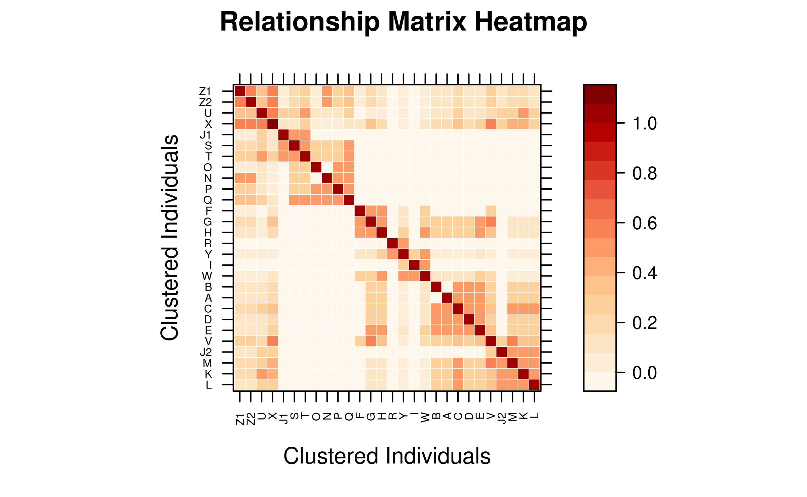
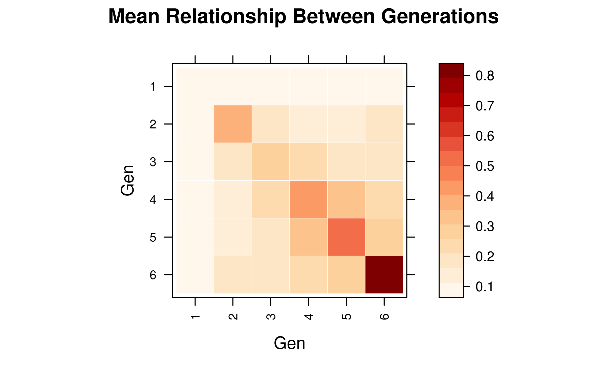
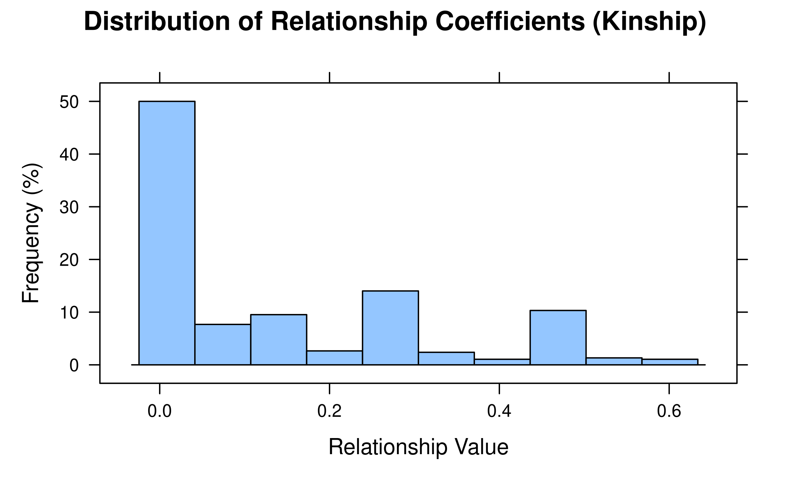

# 3. Calculation and visualization of relationship matrix

1.  [Calculating Relationship Matrices with pedmat()](#id_1)  
    1.1 [Supported Methods](#id_1-1)  
    1.2 [Basic Usage](#id_1-2)  
    1.3 [Sparse Matrix Representation](#id_1-3)  
2.  [Inspecting the Matrix](#id_2)  
    2.1 [Summary Statistics](#id_2-1)  
    2.2 [Querying Specific Relationships](#id_2-2)  
3.  [Compact Mode for Large Pedigrees](#id_3)  
    3.1 [Using compact = TRUE](#id_3-1)  
    3.2 [Expanding and Querying Compacted Matrices](#id_3-2)  
    3.3 [When to Use Compact Mode](#id_3-3)  
4.  [Visualizing Relationship Matrices with vismat()](#id_4)  
    4.1 [Relationship Heatmaps](#id_4-1)  
    4.2 [Inbreeding and Kinship Histograms](#id_4-2)  
5.  [Performance Considerations](#id_5)

Relationship matrices are fundamental tools in quantitative genetics and
animal breeding. They quantify the genetic similarity between
individuals due to shared ancestry, which is essential for estimating
breeding values (BLUP) and managing genetic diversity. The `visPedigree`
package provides efficient tools for calculating various relationship
matrices and visualizing them through heatmaps and histograms.

## 1. Calculating Relationship Matrices with `pedmat()`

The
[`pedmat()`](https://luansheng.github.io/visPedigree/reference/pedmat.md)
function is the primary tool for calculating relationship matrices. It
supports both additive and dominance relationship matrices, as well as
their inverses.

### 1.1 Supported Methods

The `method` parameter in
[`pedmat()`](https://luansheng.github.io/visPedigree/reference/pedmat.md)
determines the type of matrix to calculate:

- **“A”**: Additive relationship matrix (Numerator Relationship Matrix).
- **“Ainv”**: Inverse of the additive relationship matrix.
- **“D”**: Dominance relationship matrix.
- **“Dinv”**: Inverse of the dominance relationship matrix.
- **“AA”**: Additive-by-additive (epistatic) relationship matrix.
- **“AAinv”**: Inverse of the epistatic relationship matrix.
- **“f”**: Inbreeding coefficients vector (uses the same optimized
  engine as `tidyped(..., inbreed = TRUE)`).

### 1.2 Basic Usage

Most calculations require a pedigree tidied by
[`tidyped()`](https://luansheng.github.io/visPedigree/reference/tidyped.md).

``` r
# Load example pedigree and tidy it
data(small_ped)
tped <- tidyped(small_ped)

# Calculate Additive Relationship Matrix (A)
mat_A <- pedmat(tped, method = "A")

# Calculate Dominance Relationship Matrix (D)
mat_D <- pedmat(tped, method = "D")

# Calculate inbreeding coefficients (f)
vec_f <- pedmat(tped, method = "f")
```

### 1.3 Sparse Matrix Representation

By default,
[`pedmat()`](https://luansheng.github.io/visPedigree/reference/pedmat.md)
returns a sparse matrix (class `dsCMatrix` from the `Matrix` package)
for relationship matrices. This is highly memory-efficient for large
pedigrees where many individuals are unrelated.

``` r
class(mat_A)
#> [1] "dsCMatrix"
#> attr(,"package")
#> [1] "Matrix"
```

## 2. Inspecting the Matrix

### 2.1 Summary Statistics

Use the [`summary()`](https://rdrr.io/r/base/summary.html) method to get
an overview of the calculated matrix, including size, density, and
average relationship.

``` r
summary(mat_A)
#> 28 x 28 sparse Matrix of class "dsCMatrix", with 226 entries
#>      i  j         x
#> 1    1  1 1.0000000
#> 2    2  2 1.0000000
#> 3    3  3 1.0000000
#> 4    4  4 1.0000000
#> 5    5  5 1.0000000
#> 6    6  6 1.0000000
#> 7    7  7 1.0000000
#> 8    8  8 1.0000000
#> 9    9  9 1.0000000
#> 10   1 10 0.5000000
#> 11   2 10 0.5000000
#> 12  10 10 1.0000000
#> 13   1 11 0.5000000
#> 14   2 11 0.5000000
#> 15  10 11 0.5000000
#> 16  11 11 1.0000000
#> 17   1 12 0.5000000
#> 18   2 12 0.5000000
#> 19  10 12 0.5000000
#> 20  11 12 0.5000000
#> 21  12 12 1.0000000
#> 22   7 13 0.5000000
#> 23   8 13 0.5000000
#> 24  13 13 1.0000000
#> 25   7 14 0.5000000
#> 26   8 14 0.5000000
#> 27  13 14 0.5000000
#> 28  14 14 1.0000000
#> 29   1 15 0.2500000
#> 30   2 15 0.2500000
#> 31   3 15 0.5000000
#> 32  10 15 0.2500000
#> 33  11 15 0.2500000
#> 34  12 15 0.5000000
#> 35  15 15 1.0000000
#> 36   1 16 0.2500000
#> 37   2 16 0.2500000
#> 38   3 16 0.5000000
#> 39  10 16 0.2500000
#> 40  11 16 0.2500000
#> 41  12 16 0.5000000
#> 42  15 16 0.5000000
#> 43  16 16 1.0000000
#> 44   1 17 0.2500000
#> 45   2 17 0.2500000
#> 46   6 17 0.5000000
#> 47  10 17 0.5000000
#> 48  11 17 0.2500000
#> 49  12 17 0.2500000
#> 50  15 17 0.1250000
#> 51  16 17 0.1250000
#> 52  17 17 1.0000000
#> 53   1 18 0.2500000
#> 54   2 18 0.2500000
#> 55   6 18 0.5000000
#> 56  10 18 0.5000000
#> 57  11 18 0.2500000
#> 58  12 18 0.2500000
#> 59  15 18 0.1250000
#> 60  16 18 0.1250000
#> 61  17 18 0.5000000
#> 62  18 18 1.0000000
#> 63   1 19 0.2500000
#> 64   2 19 0.2500000
#> 65   6 19 0.5000000
#> 66  10 19 0.5000000
#> 67  11 19 0.2500000
#> 68  12 19 0.2500000
#> 69  15 19 0.1250000
#> 70  16 19 0.1250000
#> 71  17 19 0.5000000
#> 72  18 19 0.5000000
#> 73  19 19 1.0000000
#> 74   5 20 0.5000000
#> 75   7 20 0.2500000
#> 76   8 20 0.2500000
#> 77  13 20 0.2500000
#> 78  14 20 0.5000000
#> 79  20 20 1.0000000
#> 80   5 21 0.5000000
#> 81   7 21 0.2500000
#> 82   8 21 0.2500000
#> 83  13 21 0.2500000
#> 84  14 21 0.5000000
#> 85  20 21 0.5000000
#> 86  21 21 1.0000000
#> 87   1 22 0.1250000
#> 88   2 22 0.1250000
#> 89   5 22 0.2500000
#> 90   6 22 0.2500000
#> 91   7 22 0.1250000
#> 92   8 22 0.1250000
#> 93  10 22 0.2500000
#> 94  11 22 0.1250000
#> 95  12 22 0.1250000
#> 96  13 22 0.1250000
#> 97  14 22 0.2500000
#> 98  15 22 0.0625000
#> 99  16 22 0.0625000
#> 100 17 22 0.5000000
#> 101 18 22 0.2500000
#> 102 19 22 0.2500000
#> 103 20 22 0.2500000
#> 104 21 22 0.5000000
#> 105 22 22 1.0000000
#> 106  1 23 0.2500000
#> 107  2 23 0.2500000
#> 108  3 23 0.2500000
#> 109  6 23 0.2500000
#> 110 10 23 0.3750000
#> 111 11 23 0.2500000
#> 112 12 23 0.3750000
#> 113 15 23 0.5625000
#> 114 16 23 0.3125000
#> 115 17 23 0.3125000
#> 116 18 23 0.3125000
#> 117 19 23 0.5625000
#> 118 22 23 0.1562500
#> 119 23 23 1.0625000
#> 120  1 24 0.1250000
#> 121  2 24 0.1250000
#> 122  3 24 0.2500000
#> 123  4 24 0.5000000
#> 124 10 24 0.1250000
#> 125 11 24 0.1250000
#> 126 12 24 0.2500000
#> 127 15 24 0.2500000
#> 128 16 24 0.5000000
#> 129 17 24 0.0625000
#> 130 18 24 0.0625000
#> 131 19 24 0.0625000
#> 132 22 24 0.0312500
#> 133 23 24 0.1562500
#> 134 24 24 1.0000000
#> 135  1 25 0.1875000
#> 136  2 25 0.1875000
#> 137  3 25 0.1250000
#> 138  5 25 0.1250000
#> 139  6 25 0.2500000
#> 140  7 25 0.0625000
#> 141  8 25 0.0625000
#> 142 10 25 0.3125000
#> 143 11 25 0.1875000
#> 144 12 25 0.2500000
#> 145 13 25 0.0625000
#> 146 14 25 0.1250000
#> 147 15 25 0.3125000
#> 148 16 25 0.1875000
#> 149 17 25 0.4062500
#> 150 18 25 0.2812500
#> 151 19 25 0.4062500
#> 152 20 25 0.1250000
#> 153 21 25 0.2500000
#> 154 22 25 0.5781250
#> 155 23 25 0.6093750
#> 156 24 25 0.0937500
#> 157 25 25 1.0781250
#> 158  1 26 0.0625000
#> 159  2 26 0.0625000
#> 160  3 26 0.1250000
#> 161  4 26 0.2500000
#> 162  9 26 0.5000000
#> 163 10 26 0.0625000
#> 164 11 26 0.0625000
#> 165 12 26 0.1250000
#> 166 15 26 0.1250000
#> 167 16 26 0.2500000
#> 168 17 26 0.0312500
#> 169 18 26 0.0312500
#> 170 19 26 0.0312500
#> 171 22 26 0.0156250
#> 172 23 26 0.0781250
#> 173 24 26 0.5000000
#> 174 25 26 0.0468750
#> 175 26 26 1.0000000
#> 176  1 27 0.0937500
#> 177  2 27 0.0937500
#> 178  3 27 0.0625000
#> 179  5 27 0.0625000
#> 180  6 27 0.1250000
#> 181  7 27 0.5312500
#> 182  8 27 0.0312500
#> 183 10 27 0.1562500
#> 184 11 27 0.0937500
#> 185 12 27 0.1250000
#> 186 13 27 0.2812500
#> 187 14 27 0.3125000
#> 188 15 27 0.1562500
#> 189 16 27 0.0937500
#> 190 17 27 0.2031250
#> 191 18 27 0.1406250
#> 192 19 27 0.2031250
#> 193 20 27 0.1875000
#> 194 21 27 0.2500000
#> 195 22 27 0.3515625
#> 196 23 27 0.3046875
#> 197 24 27 0.0468750
#> 198 25 27 0.5703125
#> 199 26 27 0.0234375
#> 200 27 27 1.0312500
#> 201  1 28 0.0937500
#> 202  2 28 0.0937500
#> 203  3 28 0.0625000
#> 204  5 28 0.0625000
#> 205  6 28 0.1250000
#> 206  7 28 0.5312500
#> 207  8 28 0.0312500
#> 208 10 28 0.1562500
#> 209 11 28 0.0937500
#> 210 12 28 0.1250000
#> 211 13 28 0.2812500
#> 212 14 28 0.3125000
#> 213 15 28 0.1562500
#> 214 16 28 0.0937500
#> 215 17 28 0.2031250
#> 216 18 28 0.1406250
#> 217 19 28 0.2031250
#> 218 20 28 0.1875000
#> 219 21 28 0.2500000
#> 220 22 28 0.3515625
#> 221 23 28 0.3046875
#> 222 24 28 0.0468750
#> 223 25 28 0.5703125
#> 224 26 28 0.0234375
#> 225 27 28 0.5507812
#> 226 28 28 1.0312500
```

### 2.2 Querying Specific Relationships

Instead of manually indexing the matrix, you can use
[`query_relationship()`](https://luansheng.github.io/visPedigree/reference/query_relationship.md)
to retrieve coefficients by individual IDs.

``` r
# Query relationship between Z1 and Z2
query_relationship(mat_A, "Z1", "Z2")
#> [1] 0.5507812

# Query multiple pairs
query_relationship(mat_A, c("Z1", "A"), c("Z2", "B"))
#> 2 x 2 sparse Matrix of class "dgCMatrix"
#>           Z2       B
#> Z1 0.5507812 0.09375
#> A  0.0937500 .
```

## 3. Compact Mode for Large Pedigrees

For large pedigrees with many full-sibling families (common in aquatic
breeding populations),
[`pedmat()`](https://luansheng.github.io/visPedigree/reference/pedmat.md)
can merge full siblings into representative nodes to save memory and
time.

### 3.1 Using `compact = TRUE`

When `compact = TRUE`, the matrix is calculated for unique
representative individuals from each full-sib family.

``` r
# Calculate compacted A matrix
mat_compact <- pedmat(tped, method = "A", compact = TRUE)

# The result is a 'pedmat' object containing the compacted matrix
print(mat_compact)
#> 23 x 23 sparse Matrix of class "dsCMatrix"
#>   [[ suppressing 23 column names 'A', 'B', 'F' ... ]]
#>                                                                              
#> A  1.00000 .       .      .    .      .     .       .       .   0.50000 0.500
#> B  .       1.00000 .      .    .      .     .       .       .   0.50000 0.500
#> F  .       .       1.0000 .    .      .     .       .       .   .       .    
#> I  .       .       .      1.00 .      .     .       .       .   .       .    
#> J1 .       .       .      .    1.0000 .     .       .       .   .       .    
#> J2 .       .       .      .    .      1.000 .       .       .   .       .    
#> N  .       .       .      .    .      .     1.00000 .       .   .       .    
#> O  .       .       .      .    .      .     .       1.00000 .   .       .    
#> R  .       .       .      .    .      .     .       .       1.0 .       .    
#> C  0.50000 0.50000 .      .    .      .     .       .       .   1.00000 0.500
#> E  0.50000 0.50000 .      .    .      .     .       .       .   0.50000 1.000
#> Q  .       .       .      .    .      .     0.50000 0.50000 .   .       .    
#> G  0.25000 0.25000 0.5000 .    .      .     .       .       .   0.25000 0.500
#> H  0.25000 0.25000 0.5000 .    .      .     .       .       .   0.25000 0.500
#> K  0.25000 0.25000 .      .    .      0.500 .       .       .   0.50000 0.250
#> M  0.25000 0.25000 .      .    .      0.500 .       .       .   0.50000 0.250
#> T  .       .       .      .    0.5000 .     0.25000 0.25000 .   .       .    
#> U  0.12500 0.12500 .      .    0.2500 0.250 0.12500 0.12500 .   0.25000 0.125
#> V  0.25000 0.25000 0.2500 .    .      0.250 .       .       .   0.37500 0.375
#> W  0.12500 0.12500 0.2500 0.50 .      .     .       .       .   0.12500 0.250
#> X  0.18750 0.18750 0.1250 .    0.1250 0.250 0.06250 0.06250 .   0.31250 0.250
#> Y  0.06250 0.06250 0.1250 0.25 .      .     .       .       0.5 0.06250 0.125
#> Z1 0.09375 0.09375 0.0625 .    0.0625 0.125 0.53125 0.03125 .   0.15625 0.125
#>                                                                              
#> A  .      0.25000 0.25000 0.250000 0.250000 .    0.1250000 0.2500000 0.125000
#> B  .      0.25000 0.25000 0.250000 0.250000 .    0.1250000 0.2500000 0.125000
#> F  .      0.50000 0.50000 .        .        .    .         0.2500000 0.250000
#> I  .      .       .       .        .        .    .         .         0.500000
#> J1 .      .       .       .        .        0.50 0.2500000 .         .       
#> J2 .      .       .       0.500000 0.500000 .    0.2500000 0.2500000 .       
#> N  0.5000 .       .       .        .        0.25 0.1250000 .         .       
#> O  0.5000 .       .       .        .        0.25 0.1250000 .         .       
#> R  .      .       .       .        .        .    .         .         .       
#> C  .      0.25000 0.25000 0.500000 0.500000 .    0.2500000 0.3750000 0.125000
#> E  .      0.50000 0.50000 0.250000 0.250000 .    0.1250000 0.3750000 0.250000
#> Q  1.0000 .       .       .        .        0.50 0.2500000 .         .       
#> G  .      1.00000 0.50000 0.125000 0.125000 .    0.0625000 0.5625000 0.250000
#> H  .      0.50000 1.00000 0.125000 0.125000 .    0.0625000 0.3125000 0.500000
#> K  .      0.12500 0.12500 1.000000 0.500000 .    0.5000000 0.3125000 0.062500
#> M  .      0.12500 0.12500 0.500000 1.000000 .    0.2500000 0.5625000 0.062500
#> T  0.5000 .       .       .        .        1.00 0.5000000 .         .       
#> U  0.2500 0.06250 0.06250 0.500000 0.250000 0.50 1.0000000 0.1562500 0.031250
#> V  .      0.56250 0.31250 0.312500 0.562500 .    0.1562500 1.0625000 0.156250
#> W  .      0.25000 0.50000 0.062500 0.062500 .    0.0312500 0.1562500 1.000000
#> X  0.1250 0.31250 0.18750 0.406250 0.406250 0.25 0.5781250 0.6093750 0.093750
#> Y  .      0.12500 0.25000 0.031250 0.031250 .    0.0156250 0.0781250 0.500000
#> Z1 0.3125 0.15625 0.09375 0.203125 0.203125 0.25 0.3515625 0.3046875 0.046875
#>                                 
#> A  0.1875000 0.0625000 0.0937500
#> B  0.1875000 0.0625000 0.0937500
#> F  0.1250000 0.1250000 0.0625000
#> I  .         0.2500000 .        
#> J1 0.1250000 .         0.0625000
#> J2 0.2500000 .         0.1250000
#> N  0.0625000 .         0.5312500
#> O  0.0625000 .         0.0312500
#> R  .         0.5000000 .        
#> C  0.3125000 0.0625000 0.1562500
#> E  0.2500000 0.1250000 0.1250000
#> Q  0.1250000 .         0.3125000
#> G  0.3125000 0.1250000 0.1562500
#> H  0.1875000 0.2500000 0.0937500
#> K  0.4062500 0.0312500 0.2031250
#> M  0.4062500 0.0312500 0.2031250
#> T  0.2500000 .         0.2500000
#> U  0.5781250 0.0156250 0.3515625
#> V  0.6093750 0.0781250 0.3046875
#> W  0.0937500 0.5000000 0.0468750
#> X  1.0781250 0.0468750 0.5703125
#> Y  0.0468750 1.0000000 0.0234375
#> Z1 0.5703125 0.0234375 1.0312500
```

### 3.2 Expanding and Querying Compacted Matrices

If you need the full matrix after a compact calculation, use
[`expand_pedmat()`](https://luansheng.github.io/visPedigree/reference/expand_pedmat.md).
For retrieving specific values,
[`query_relationship()`](https://luansheng.github.io/visPedigree/reference/query_relationship.md)
handles both standard and compact objects transparently.

``` r
# Expand to full 28x28 matrix
mat_full <- expand_pedmat(mat_compact)
dim(mat_full)
#> [1] 28 28

# Query still works the same way
query_relationship(mat_compact, "Z1", "Z2")
#> [1] 0.5507812
```

### 3.3 When to Use Compact Mode

Compact mode is highly recommended for:

- **Large Pedigrees**: More than 5,000 individuals with substantial
  full-sibling groups.
- **High-fecundity species**: Such as aquatic animals or plants, where
  families often have hundreds or thousands of offspring.
- **Memory-limited environments**: When the full matrix exceeds
  available RAM.

| Pedigree Size | Full-Sib Proportion | Recommended Mode   |
|:--------------|:--------------------|:-------------------|
| \< 1,000      | Any                 | Standard           |
| \> 5,000      | \< 20%              | Standard / Compact |
| \> 5,000      | \> 20%              | **Compact**        |

## 4. Visualizing Relationship Matrices with `vismat()`

Visualization helps in understanding population structure, detecting
family clusters, and checking the distribution of genetic relationships.

### 4.1 Relationship Heatmaps

The “heatmap” type (default) uses a Nature Genetics style color palette
(White-Orange-Red) to display relationships.

``` r
# Heatmap of the A matrix
vismat(mat_A)
```



#### Reordering and Clustering

Setting `reorder = TRUE` (default) performs hierarchical clustering to
group related individuals together.

#### Grouping by Labels

You can aggregate relationships by groups (e.g., generations) using the
`grouping` parameter.

``` r
# Mean relationship between generations
vismat(mat_A, ped = tped, grouping = "Gen")
#> Aggregating 28 individuals into 6 groups based on 'Gen'...
```



### 4.2 Inbreeding and Kinship Histograms

The “histogram” type displays the distribution of relationship
coefficients (lower triangle) or inbreeding coefficients.

``` r
# Distribution of relationship coefficients
vismat(mat_A, type = "histogram")
```



## 5. Performance Considerations

Calculation and visualization of large matrices can be
resource-intensive.
[`vismat()`](https://luansheng.github.io/visPedigree/reference/vismat.md)
includes several optimizations for large datasets:

- **N \> 2000**: For heatmaps larger than 2000x2000, labels are
  suppressed.
- **N \> 500**: For heatmaps larger than 500x500, reordering is disabled
  by default to save time.
- **Compact Pedigree**: Using a tidied pedigree with `compact = TRUE` is
  recommended for high-fecundity species.

------------------------------------------------------------------------

**See Also:** -
[`vignette("tidy-pedigree", package = "visPedigree")`](https://luansheng.github.io/visPedigree/articles/tidy-pedigree.md) -
[`vignette("draw-pedigree", package = "visPedigree")`](https://luansheng.github.io/visPedigree/articles/draw-pedigree.md)
